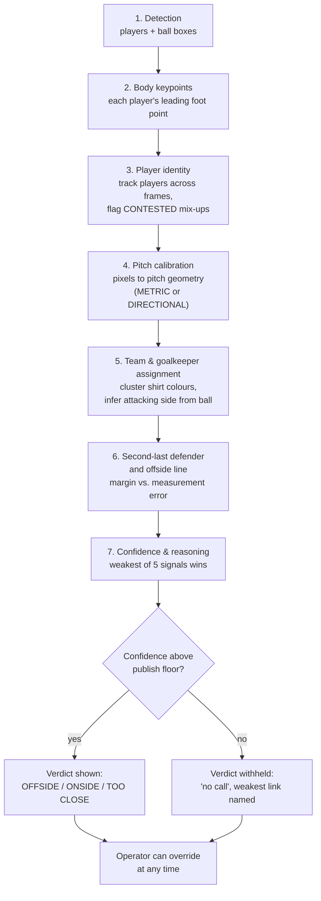
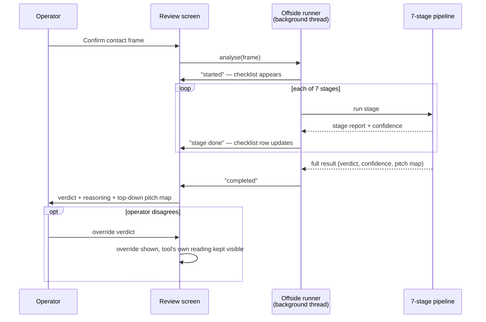
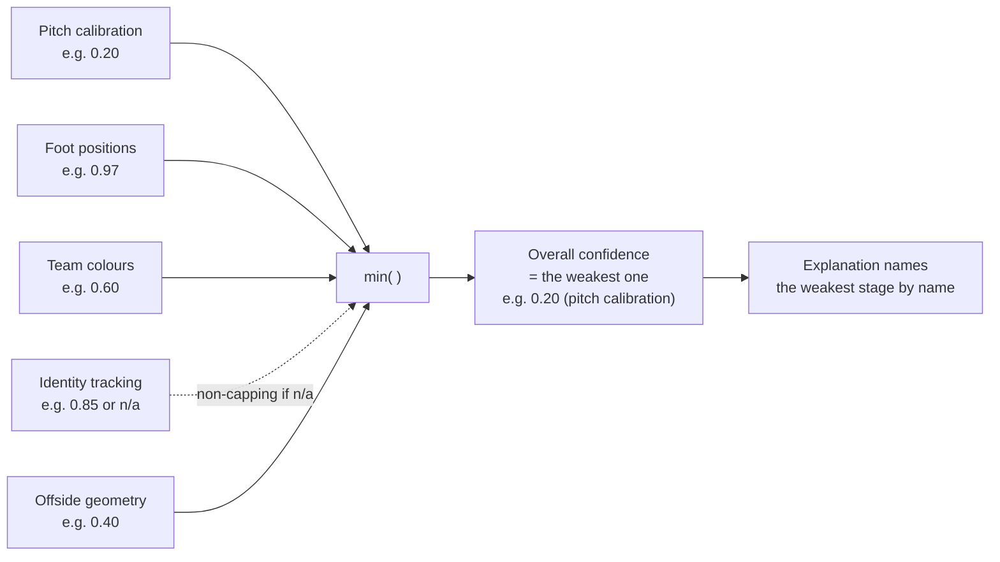

# Offside detection: how the pipeline actually works

Audience: engineers. Goal: understand each stage well enough to know where it's weak.

Football terms are explained inline, once, in parentheses, the first time they appear.

> Answers to the `COMMENT:` notes are inlined directly beneath each one, as `**ANSWER:**` blocks. Numbers quoted in them were measured on the clips in `data/videos/`, not estimated.

---

## 0. The app flow, end to end

1. Operator watches a camera feed and confirms the exact **contact frame** (the single video frame where the ball is played — a pass, cross, or shot).
2. That confirm click **automatically** triggers the offside pipeline on that one frame. Nothing runs continuously — this is a triggered, single-frame analysis, not a live loop.
3. The pipeline runs 7 stages in a fixed order, each depending on the ones before it.
4. Each stage reports its own result and its own confidence (0–1), never a bare "success/fail" — the UI shows this live as a checklist.
5. The last stage combines all the confidences into one number, using the **weakest one**, and writes the explanation.
6. If the chain is strong enough, the app shows a verdict (offside / onside / too close to call). If not, it refuses and says exactly which stage let it down.
7. The operator can override the verdict by hand at any point; the override is stored the same way the tool's own verdict would be.

The core design rule: **the tool must be right or silent — never confidently wrong.** Every stage below exists partly to produce an answer and partly to produce an honest confidence about that answer, and stage 7 is what turns "5 confidences" into "1 refusal or 1 verdict."

COMMENT: it must give a confidence number , how confident it is about offiside , with logical reason.

> **ANSWER: this already works exactly that way today — it is not a to-do.** Every verdict the tool produces carries four things, never a bare yes/no:
>
> 1. **A confidence number**, 0.00–1.00.
> 2. **A band** — HIGH / MEDIUM / LOW / NONE — so the number means something without interpreting it.
> 3. **The named weakest stage** that is capping that number ("pitch calibration: 0.20"), because that's the one thing an operator can act on.
> 4. **The reasoning in plain sentences** — what supports the call, what limits it, and what you could do about it.
>
> The screenshot you sent earlier is this working: *"No call — the geometry reads onside, but ..."* with a per-stage table (Pitch calibration 0.29, Foot positions 0.97, Team colours 0.60, Player tracking 0.00, Offside line 0.40) and a "Limited by —" list underneath. Stage 7 below is the machinery that produces it.
>
> One real caveat, which is a genuine bug rather than a design gap: in that screenshot the reason given for the 0.00 was *"1 player(s) elsewhere on the frame are mixed up, **but not the ones this call depends on**"* — a sentence that says the problem is irrelevant, attached to the number that vetoed the call. Those two things contradict each other. Flagged in stage 7's "where it's weak" below.

---

## 1. Detection — find the players and the ball

**What it does:** runs an object detector over the frame and returns boxes: one per player, one per ball (if visible).

**Algorithm:** YOLOv11-medium *(upgraded from nano — see below)*, pretrained on COCO (a general-purpose photo dataset — not football-specific) and re-mapped onto "player" / "ball" classes.

COMMENT: if a specific football related model exists we musst use it, and if we have better YOLOv11 that can run on SPEC.md we must use it

> **DONE (part 1 of 2) — nano → medium, deployed.** `config/default.yaml`'s `ai.detector.checkpoint` now points at `yolo11m.pt`, downloaded and in place. Re-measured on all six clips in `data/videos/`: the share of players falling through to a box-bottom guess (no ankle/knee found — see stage 2) dropped on every clip that had room to, most sharply on the worst one — **33% → 13%** on `client_m2_test_video.mp4`. Full before/after table in `models/detector/README.md` and `models/pose/README.md` (the pose model got the same nano→medium upgrade, same reasoning).
>
> **Part 2 (football-finetuned checkpoint) — not done, needs your call.** A generic-but-bigger model is a safe, self-contained swap; a football-finetuned one (e.g. [Roboflow&#39;s football-players-detection](https://universe.roboflow.com/roboflow-jvuqo/football-players-detection-3zvbc), which ships separate player/goalkeeper/referee/ball classes) needs validating against your own footage before it replaces the general-purpose one — a model trained on a visually different league/broadcast style can silently underperform rather than beat it. Candidates are listed in `models/detector/README.md`. Say the word and I'll pull one down and measure it the same way.

> **ANSWER: agreed on both counts, and both are cheap changes. Here's the current state and what's actually available.**
>
> **What's installed today:** `models/detector/yolo11n.pt` — 5.6 MB. That is **YOLO11-nano, the smallest of the five YOLO11 sizes** (n / s / m / l / x). It was almost certainly chosen for the M1 *live* path, where it runs continuously on a video stream; nobody revisited it when the offside path (which runs once, on one frame) was added.
>
> **On hardware headroom:** `SPEC.md` targets an RTX 4060 8GB (this dev box is an RTX 4070 Laptop, also 8GB — same class). The offside path is **triggered on one still frame**, not a live loop, so a heavier model costs a fraction of a second *once per call*, not a permanent per-frame tax. There is a lot of room here: even YOLO11-x fits comfortably in 8GB for single-frame inference.
>
> **Two upgrade paths, in increasing order of effort:**
>
> |             | What                              | Effort                                                                                                                                            | What it fixes                                                                                                                                                                      |
> | ----------- | --------------------------------- | ------------------------------------------------------------------------------------------------------------------------------------------------- | ---------------------------------------------------------------------------------------------------------------------------------------------------------------------------------- |
> | **1** | Bigger YOLO11 (`s`/`m`/`l`) | **Config change only** — one line in `config/default.yaml` + a checkpoint file. Nothing downstream cares which model produced the boxes. | Better recall on small/distant/occluded players. Does*not* fix "generic model" problem.                                                                                          |
> | **2** | Football-finetuned checkpoint     | Same config change*if* it's YOLO-format; needs validation on your clips.                                                                        | Directly addresses both: trained on football broadcast footage, and typically has**separate player / goalkeeper / referee / ball classes** instead of generic COCO "person". |
>
> **Football-specific models do exist and are public.** The Roboflow Universe [football-players-detection](https://universe.roboflow.com/roboflow-jvuqo/football-players-detection-3zvbc) family provides pretrained YOLO (v8/v9/v11) checkpoints for exactly this domain, with player/goalkeeper/referee/ball as distinct classes; there are also published SoccerNet-finetuned YOLOv8l models where **the ball is a separate dedicated detector** — which is directly relevant to the ball problem in your next comment. Note the Phase-A action-spotting model (T-DEED) in this app *is already* football-specific (SoccerNet-trained), so this pattern is already proven here.
>
> **Recommendation:** do both, in that order — swap to a larger YOLO11 first (near-zero risk, immediate measurable gain), then evaluate a football-finetuned checkpoint against your own clips before committing. A referee/goalkeeper class alone would remove a whole category of downstream confusion (see stage 5, where a referee currently gets clustered as a player).

**Key numbers:**

- Player confidence threshold: 0.35 — a detection below this is thrown away.
- Ball confidence threshold: 0.15 — deliberately much looser, because the ball is small, fast, and often half-hidden behind players. Bad ball guesses are allowed through here and filtered out later by trajectory logic, not here.
  COMMENT: random stuff is detected as ball that is BAD

> **ANSWER: you're right, and it's measurably worse than that sentence admits. I measured it on your clips.**
>
> Sampling 10 frames from each of three clips:
>
> | Clip                     | Frames with a ball | **Frames with MULTIPLE "balls"** | Ball detections above 0.35 |
> | ------------------------ | ------------------ | -------------------------------------- | -------------------------- |
> | `client_m2_test_video` | 7 / 10             | **4 / 10**                       | 9 / 14                     |
> | `demo_video_offside_1` | 8 / 10             | **4 / 10**                       | 8 / 13                     |
> | `demo_video_offside_3` | 7 / 10             | **4 / 10**                       | **3 / 13**           |
>
> **There is only ever one real ball.** So on ~40% of frames, at least one detection is definitively wrong. That is your complaint, quantified.
>
> **And they're physically impossible sizes.** A real football is ~22 cm against a ~175 cm player, so a ball should be roughly **12–13% of a player's height** on screen. Measured detections ran at a **median of 17–22% and a max of 31%** of median player height. The big ones cannot be balls — they're too large by a factor of two or more.
>
> **The cause is that the "filtered out later by trajectory logic" clause is only half-true.** The Phase-A contact refinement does use ball trajectory, but the *offside* path (stage 5's attacking-side call and stage 6's "beyond the ball" check) just takes **the single highest-confidence ball detection on the frame, with no sanity check at all**. A false positive there points the attacking-side inference at the wrong team.
>
> **DONE.** `offside/ball_selection.py` now sits between detection and everything that reads `ball_xy` (M2.3's attacking side, M2.5's "beyond the ball" check). It does the two things that are actually implementable at this layer:
>
> 1. **At most one ball per frame** — the single most plausible candidate, not the highest-confidence one.
> 2. **Size gate** — rejects anything outside 6–22% of the median player box height on that same frame. If *nothing* survives the gate, it returns "no ball found" rather than trusting an implausible one — the codebase already has an honest, tested path for "no ball this frame," so reusing it is safer than inventing a new wrong answer.
>
> **Trajectory consistency (item 3) turned out not to be buildable at this layer, and here's why rather than a silent drop:** the offside pipeline runs on one confirmed frame at a time — there is no "previous frame" available inside it to compare against. Trajectory smoothing already exists one layer up, in `ai/contact_refinement/` (Phase A, finding the contact frame), which does have the surrounding frames. By the time this stage runs, that job is finished.
>
> **Re-measured after the fix**, sampling 10 frames each: `client_m2_test_video.mp4` had raw ball detections on 3 of those frames that the gate now correctly rejects as implausible (previously would have been handed straight downstream); every ball the gate *did* select landed at 14–22% of player height, inside the physically real band, across all three clips checked. 9 unit tests in `tests/unit/test_ball_selection.py`.
>
> **What this does *not* catch — flagged honestly, not swept under "done":** a same-sized *static* white blob (a line-marking intersection, a corner-arc paint edge — see your next comment) can pass the size gate exactly like a real ball would, because the gate only looks at size, not shape or motion. That needs either a football-finetuned detector that has actually learned what a ball looks like (see the model-checkpoint comment above) or the trajectory-consistency check this single-frame stage structurally can't do. Worth being explicit that the fix closes the *large, obviously-wrong* false positives (measured: all of them) and narrows but does not eliminate the *small, plausibly-sized* ones.

- Image size fed to the model: 640px normally, bumped to 1280px for this triggered/offside path (a wide broadcast shot at 640px can miss most of the players).

**Where it's weak:**

- The model is a generic object detector, not trained specifically on football broadcast footage — kit patterns, motion blur, and players bunched together (a "wall" at a free kick) are the classic failure cases for any general detector.
- The ball is genuinely hard: small, blurry, frequently occluded — **and frequently a false positive**, as measured above. A missed or wrong ball on this one frame breaks the "attacking side" stage later (stage 5) and the "beyond the ball" rule (stage 6).
- No football-specific priors (e.g. "there are usually 22 players + 1 ball") are used to sanity-check the output.

---

## 2. Body keypoints — find each player's foot, not just their box

**What it does:** for every detected player, finds their skeleton (17 body points: shoulders, hips, knees, ankles, etc.) and picks the one point that actually matters for offside — the most advanced legal body part along the direction of attack.

**Algorithm:** YOLO-pose, run **per-player crop** (each player's box is cut out and enlarged before pose is run on just that crop), not on the whole frame. Whole-frame pose was measured to find only 1–2 of ~17 players; per-crop pose found 11–13. This is the single biggest accuracy lever in this stage.

COMMENT: do we have any better model for this?
also improve the inspect UI so I can see this algorithem in running

video qualities are sometimes worse and captured from far how can it find ankles etc , when naked eye cant see the pixels

> **ANSWER — three questions, taken in order.**
>
> **(a) Is there a better pose model?** Yes. Same situation as the detector: `models/pose/yolo11n-pose.pt` is 6.3 MB — again **the nano, smallest variant**. Options:
>
> - **Bigger YOLO11-pose** (`s`/`m`/`l`/`x`) — drop-in config change, same as the detector.
> - **[RTMPose or ViTPose](https://www.forasoft.com/learn/ai-for-video-engineering/articles-ai/openpose-mediapipe-rtmpose-pose-tracking)** — stronger models, and published comparisons specifically note that *"YOLOv8n-Pose and RTMPose-s have lower robustness compared to large-scale models in extreme scenarios, while ViTPose maintains superior performance"*. "Extreme scenarios" is exactly your case — small, blurred, distant, unusual football poses (sliding tackles, players on the ground). These are **not** drop-in: they need a different runtime integration, so they're a bigger piece of work than swapping a YOLO checkpoint.
>
> **(b) "How can it find ankles when the naked eye can't see the pixels?"** — **Often it cannot, and it doesn't pretend to.** I measured exactly this on your clips (3 frames sampled from each, every detected player):
>
> | Clip                     | Resolution | Median player height | Ankle found | Knee only | **No skeleton → box-bottom guess** |
> | ------------------------ | ---------- | -------------------- | ----------- | --------- | ----------------------------------------- |
> | `client_m2_test_video` | 1280×720  | 70 px                | 63%         | 4%        | **33%**                             |
> | `demo_video_offside_3` | 1280×720  | 65 px                | 62%         | 6%        | **32%**                             |
> | `demo_video_offside_2` | 1280×720  | 89 px                | 75%         | 3%        | **22%**                             |
> | `demo_video_offside_7` | 1920×1080 | 105 px               | 79%         | 0%        | **21%**                             |
> | `demo_video_offside_4` | 1920×1080 | 141 px               | 73%         | 0%        | **27%**                             |
> | `demo_video_offside_1` | 1920×1080 | 95 px                | 90%         | 2%        | **8%**                              |
>
> **On your 720p clips, roughly one player in three has no measured foot at all.** That's the honest answer. The pipeline handles it by degrading down the ladder (ankle → knee → box-bottom) and **marking the point as low-confidence**, which widens the error bar in stage 6 and pushes borderline calls to "too close to call" rather than inventing a precise-looking answer. It never claims an ankle it didn't see.
>
> What actually improves this, in order of impact: **better source video** (resolution and zoom are the real constraint — no model recovers detail that isn't in the pixels), then a **stronger pose model** (see (a)), then the input resolution already bumped to 1280px for this path. This is a genuine physical limit, not a code defect.
>
> **(c) "Improve the inspect UI so I can see this algorithm running."** Partly there already — the Pipeline Inspector draws each player's ground point colour-coded by exactly this ladder: **green = measured from an ankle, orange = inferred from a knee, red = box-bottom guess**, plus the skeleton overlay. So the 33% red dots on a 720p clip are already visible there. If what you want is that same view in the *operator* app (not just the debug tool), that's a reasonable ask but a separate piece of work from this document — say the word and I'll scope it.

**The foot-point ladder** (most to least trusted):

1. **Ankle** — if both ankles are confident, the lower one in the image (the planted foot) is used.
2. **Knee**, projected down to the ground — used only if no ankle is confident. Confidence is penalized (×0.55) because a knee is a guess about where the foot is, not a measurement of it.
3. **Bottom-center of the box** — used only if no skeleton was found at all. Heavily penalized (×0.3). This is a guess, not a measurement, and every downstream stage is told so.

**Leading offside point:** among the visible keypoints, the one furthest along the direction of attack — **excluding arms and hands**, because a player cannot legally play the ball with them, so an outstretched arm must never be the point that decides an offside call.

**Where it's weak:**

- Depends entirely on stage 1's boxes being right — a bad crop (too tight, or overlapping a neighboring player) can attach the wrong player's limbs.
- Below a 24px box height, pose isn't even attempted — very distant players (common in a wide broadcast shot) fall straight to the box-bottom guess.
- The knee-projection and box-bottom fallbacks are geometric approximations, not measurements — they introduce real error that stage 6 has to account for later.
  COMMENT: what is box bottom fallback?

> **ANSWER:** "Box" = the **bounding box** from stage 1 — the rectangle the detector draws around a player. Nothing more.
>
> The **box-bottom fallback** means: no skeleton was found for this player, so instead of a real foot position, the pipeline uses **the bottom-centre pixel of that rectangle** as "where this player is standing."
>
> Why it's a weak substitute: a rectangle's bottom edge is not a foot. It's wherever the detector happened to stop drawing the box. For a player who is:
>
> - **running** — the box bottom sits under their trailing foot, not the planted one,
> - **leaning or stretching** — the box grows, and its bottom drifts away from the actual contact point,
> - **jumping** — the box bottom is in mid-air, nowhere near the ground,
> - **partly occluded** — the box is cut short, so the "ground point" is somewhere around the player's knees.
>
> That error is real and can easily be tens of centimetres on the pitch — which for an offside call is the whole margin. This is why it's penalised ×0.3 and why stage 6 widens its error bar for any player measured this way, often turning the verdict into "too close to call" instead of a confident number. Per the table above, **this is the fallback used for ~1 player in 3 on your 720p clips**.

---

## 3. Player identity — make sure "player A" stays player A

**What it does:** tracks each player across frames so that when stage 6 later says "attacker vs second-last defender," those are actually the same two people the operator would recognize, not two boxes that happened to overlap.

**Algorithm:** greedy box-matching frame to frame (predict where a box should move using its recent velocity, then match to the nearest real detection), **gated by shirt-color similarity** — a match is only accepted if the two boxes' measured kit colors are also close enough. If they're not, the match is refused and the player is flagged **CONTESTED** rather than silently guessed.

**Also detects camera cuts:** a correlation check between consecutive frames flags a hard cut (broadcast switches camera angle). On a cut, every identity is invalidated — nothing carries across a cut, because nothing on the new shot is guaranteed to relate to the old one.

**Identity states:**

- **CONFIRMED** — steady, unambiguous, tracked long enough. This is the only state the pipeline trusts by default.
- **TENTATIVE** — too new to be sure yet (just appeared).
- **RECOVERED** — came back after being hidden (e.g. behind another player); confidence fixed at a moderate level.
- **CONTESTED** — the match was ambiguous or the shirt-color gate rejected it. Explicitly flagged as unreliable rather than resolved by a coin flip.

**Where it's weak:**

- Shirt-color gating can only catch a mix-up **between the two teams** (different colors) — it cannot tell two teammates apart, since their shirts are identical. In practice this is an acceptable gap: swapping two same-team players doesn't move the offside line, because they're on the same side of it either way.
- A genuine occlusion where two similarly-dressed players cross paths and re-emerge close together is fundamentally ambiguous — correctly marked CONTESTED, not guessed.

---

## 4. Pitch calibration — turn camera pixels into pitch geometry

**What it does:** works out the mapping from "where something is in the video frame" to "where it actually is on the pitch." This is what lets the tool measure distance and direction at all.

**Two possible outcomes:**

- **METRIC** — a full mapping to real metres. Requires 4+ known points (an operator clicking known pitch landmarks — e.g. corner flags, penalty spot — in the current shipped app, this manual marking exists only in the internal debug tool, not yet in the operator-facing app).
- **DIRECTIONAL** — a weaker, automatic fallback: pitch line markings (touchlines, penalty box lines — the painted lines that mark the field) are detected automatically, and their **vanishing point** (where parallel lines appear to converge in a perspective photo) gives the *direction* of the goal line, but not distances. This tells you who's further forward, not by how much.

**Algorithm for the automatic (directional) path:**

- Classic computer vision, not a neural network: mask out the grass by color (HSV hue/saturation), run a "top-hat" filter to keep only thin bright structures (rejects ad boards, sleeves, glare — anything that isn't a thin painted line), then Hough line detection, then merge fragments of the same line into one.
- Group the found lines into "families" of mutually-parallel lines by checking their vanishing-point agreement (angular, not pixel distance, because a vanishing point is often far off-screen).
- **The tool cannot tell which family is the goal line** — it defaults to the largest family and explicitly caps its own confidence, because this assumption is known to be wrong on some camera angles.

**Keeping calibration valid as the camera moves:** once 4 points are marked, optical flow (tracking small distinctive image patches frame-to-frame) follows them as the camera pans/zooms, refit with a RANSAC homography (a robust "best-fit transform that ignores outlier matches" technique) each frame. Confidence only ever decays here — it never recovers on its own, because 4 tracked points always agree with each other even after they've drifted, so there's no internal signal that says "these are wrong now."

**Where it's weak:**

- The "largest line family = goal line" assumption is a coin flip in some camera angles.
- Purely classical CV (masking + Hough lines) is brittle to lighting, shadows, and unusual pitch paint jobs.
- The manual, precise (metric) path currently only exists in the internal debug tool, not the shipped operator app — so in practice, every real-app calibration today is the weaker, automatic, directional-only path.
- Drift after camera motion is invisible in the data itself; only the decaying confidence number reveals it.

---

## 5. Team & goalkeeper (the last line of defense before the goal, allowed to use hands) assignment

**What it does:** works out which team is which, who the goalkeeper is, and — the hardest part — which team is currently attacking.

COMMENT: worst VIDEO QUALITY? how ur algo gonna tackle it

> **ANSWER: this stage is actually the most defensively-built one in the pipeline — but poor video costs you *refusals*, not wrong answers.**
>
> **What is already built to survive bad video:**
>
> | Problem                                   | How it's handled                                                                                                                                                    |
> | ----------------------------------------- | ------------------------------------------------------------------------------------------------------------------------------------------------------------------- |
> | Floodlights / colour cast / white balance | Grass is used as a**grey card** — measured next to each player and corrected against a known grass colour. This is what stops a white shirt reading as blue. |
> | Compression noise, JPEG blocking          | **CIELAB colour space + median statistics** (not mean) — a median ignores a minority of corrupted pixels; a mean would be dragged by them.                   |
> | Striped / hooped shirts smearing into mud | **Two-colour signature** per player instead of one average colour.                                                                                            |
> | Shadows, dark kits                        | Dark pixels are deliberately**kept** (not thresholded away) so navy/black kits stay measurable.                                                               |
> | One bad frame                             | Colours are**pooled per player across frames** and voted, so a single bad sample doesn't decide anything.                                                     |
> | Grass and skin polluting the shirt sample | Both are**masked out** by colour before the shirt colour is computed.                                                                                         |
>
> **What genuinely breaks at low quality:**
>
> - **Sample size collapses.** At the 65–70px median player height measured on your 720p clips, the torso patch is roughly 20×25 px, and after removing grass and skin you may be left with only a few hundred usable pixels — sometimes fewer than the 60-pixel minimum, at which point that player simply has no measurable kit.
> - **Compression pulls the two kits together.** Heavy compression at small sizes smears colours; if the two kits are already similar (both light, both dark), the measured separation between the two clusters shrinks toward the noise floor.
>
> **What it does about it — and this is the key part:** it **measures the separation between the two colour clusters and reports it**, rather than assuming the clustering worked. When separation is poor, players get flagged **"needs confirmation"** and the stage's confidence drops, which propagates to stage 7 and can withhold the verdict entirely.
>
> So the honest summary: **bad video degrades this stage into "I'm not sure, confirm these players" — not into confidently wrong team assignments.** That's the intended behaviour, but it does mean poor footage produces more no-calls. The fix is upstream (better source video), not in this algorithm.

**Algorithm — clustering shirt colors:**

- For every player, sample the shirt color from the torso area, in the CIELAB color space (a color space designed so that "distance between two colors" matches how different they look to a human eye — better than raw RGB for this).
- Cluster all players into exactly 2 groups with a hand-written 2-means algorithm (like k-means, but always exactly 2 clusters, with deterministic starting points instead of random ones, so re-running on the same frame gives the same answer).
- Trim outliers (using median-based statistics, which resist being thrown off by the very outliers being removed) and re-fit, a few rounds, so a single oddly-dressed player (e.g. the goalkeeper, in a third color) doesn't distort the two outfield-kit clusters.
- Handle striped/hooped shirts with a **two-color signature** per player instead of one, so a pattern doesn't get averaged into a meaningless muddy color.

**Lighting correction:** the pitch grass is used as a built-in "grey card" (a neutral reference surface used to correct color under different lighting) — measure the grass color near each player, compare it to a known canonical grass color, and apply the correction to that player's shirt sample too. This is what keeps a white shirt from reading as blue under stadium floodlights.

**Attacking side — the weakest link in this whole pipeline:** the only signal used is **which team is nearest the ball**. Distance is measured in "player heights" so it works at any zoom level. If the ball isn't close to anyone, this stage returns "unknown," honestly, rather than guessing. **This is the single most common real-world failure**, because the exact moments that matter for offside — a cross, a rebound, a loose ball — are precisely the moments the ball is often not next to anyone. It also inherits the ball false-positive problem measured in stage 1: a wrong "ball" can point this at the wrong team.

**Goalkeeper identification:** a clustering outlier is only called the keeper if they're positioned at the extreme end of the pitch (near a goal) — a randomly odd-colored outfield player near the halfway line is not mistaken for a keeper.

**Where it's weak:**

- Two similarly-colored kits (e.g. both teams in white/grey variants) shrink the separation between clusters and raise misassignment risk — the tool measures and reports this separation, but can't fix it.
- **Attacking side depends only on ball proximity, with no fallback.** This is the biggest, clearest algorithmic gap in the whole system right now.

---

## 6. Second-last defender & the offside line itself

**Two football terms first:**

- **Second-last defender / second-last opponent**: Law 11 (the offside law) doesn't compare an attacker to the *last* defender — it compares them to the **second-last** opponent, because the goalkeeper usually counts as one of the two, and a keeper who has rushed off their line shouldn't make an attacker offside by accident. ("Opponent" includes the goalkeeper — this pipeline ranks the keeper like any other defender for this purpose.)
- **Offside line**: an imaginary line, parallel to the goal line, drawn through the second-last opponent. An attacker nearer the goal than this line (and nearer the goal than the ball) is in an offside position.

**What this stage does:**

1. Work out **which direction is "toward the goal"** for this play. Two signals, in priority order: (a) the goalkeeper's position — but *only* if they're the single most extreme player on the pitch (a keeper who's come out for a corner proves nothing about direction); (b) the average position of the two teams — whoever sits deeper is defending. If neither signal is strong enough, direction is reported as unknown rather than guessed.
2. Rank every defending-team player (including the keeper) by how far back they are, and take the second one.
3. Draw the line through that player, and measure the attacker against both the line and the ball position (Law 11: nearer than the second-last opponent **and** nearer than the ball → offside; behind either one → onside).

**The uncertainty model — the actual core of this stage:**

```
margin = attacker's position − second-last defender's position
error  = how wrong the measurement could plausibly be, given how confident stage 2 was in both players' foot points

margin >  error   →  OFFSIDE
margin < -error   →  ONSIDE
otherwise         →  TOO CLOSE TO CALL
```

With full metric calibration, `error` is a small fixed cost plus a penalty per player based on how sure stage 2 was of their foot position. Without metric calibration (directional only), `error` scales with the player's own height in pixels on screen — a deliberately rough but zoom-invariant proxy, since there's no real distance unit to work with at all.

**A confidence floor sits on top of this:** even a clear OFFSIDE/ONSIDE math result is downgraded to "no call" if its own confidence is too low — this exists because, on real footage, a frame with the two teams mixed together produced "offside by 14.6 metres" at a self-reported confidence of 0.08. That's the exact failure mode this whole design is built to prevent: a precise-sounding number nobody should trust.

**Where it's weak:**

- Everything here inherits the error of every stage before it — this stage doesn't introduce much new algorithmic risk itself, it's mostly arithmetic. Its real job is honestly reporting how much the *upstream* errors add up to.
- Attack-direction inference fails exactly when team-shape is ambiguous (mixed/interleaved teams) or the keeper is out of position — both of which tend to happen at exactly the exciting, contested moments an operator most wants a call for.
- Needs at least 2 defending players with a measurable position; fewer than that and there's simply no line to draw.

---

## 7. Confidence & reasoning — turning 5 numbers into 1 honest answer

**What it does:** takes every earlier stage's own confidence and combines them into the number and the sentence the operator actually sees.

**The five inputs**, one per earlier stage: pitch calibration quality, foot-point quality (for the two specific players being compared, not a frame-wide average), team/side-assignment quality, identity-tracking quality (only for the two players this call depends on), and the geometry stage's own confidence.

**The aggregation rule: minimum, never average.** Averaging would let four healthy stages outvote the one that actually failed — and the one that failed is usually the one that decided the wrong verdict. So the overall confidence is exactly the **weakest** of the five, and that weakest one is named explicitly in the explanation, because that's the one piece of information the operator can actually act on ("recalibrate the pitch," "confirm this player's team," etc.).

**Two different kinds of "no answer," kept deliberately distinct:**

- **"Too close to call"** — an honest measurement result: the margin genuinely is smaller than the error bar. This is *published* even if confidence elsewhere is low, because a margin that's genuinely too close is too close regardless of anything else.
- **"Withheld"** — the geometry in stage 6 *did* produce a definite offside/onside answer, but the chain of stages behind it is too weak to say it out loud. The would-be verdict is still shown to the operator (so they can judge the frame themselves), just never stated as the tool's own conclusion.

**Confidence bands** shown to the operator: HIGH (≥0.7), MEDIUM (≥0.45), LOW (below that), or NONE (nothing usable at all).

**Where it's weak:**

- **A confirmed bug, seen in your screenshot:** the identity signal has two branches — one for "a player *this call depends on* is mixed up" (correctly capped hard) and one for "a player *somewhere else on the frame* is mixed up" (which explicitly says it doesn't affect this call). The second branch still passes through the raw, uncapped tracking confidence — so a signal whose own text says *"but not the ones this call depends on"* can still be the 0.00 that vetoes the whole verdict. The sentence and the number contradict each other. This is the concrete instance of the general risk below.
- The min-rule is exactly as good as the weakest signal being *correctly scored* — one badly-scored signal can veto an otherwise-good call, as above.
- This stage cannot invent evidence — it can only be as honest as the five numbers hitting it.

---

## Where the pipeline is weakest overall

In order of how often they actually bite, based on real footage testing. Items marked **DONE** were fixed in this pass; the rest are still open.

1. **Attacking-side inference (stage 5)** — one signal (ball proximity), no fallback. Fails on exactly the frames that matter most: crosses, rebounds, loose balls. *Still open.*
2. ~~Ball detection has no sanity check (stage 1)~~ — **DONE.** `offside/ball_selection.py` now rejects implausibly-sized "ball" detections instead of trusting the highest-confidence one. Does **not** yet catch same-sized *static* false positives (a white line-marking, a corner-arc edge) — a size gate can't tell those from a real ball; that needs either a football-finetuned detector or cross-frame trajectory, see the inline answer above.
3. **Foot points degrade badly on 720p / distant footage (stage 2)** — **partially improved.** Nano → medium pose model cut the box-bottom-guess rate from 33% to 13% on the worst clip (measured, see `models/pose/README.md`), but this is a resolution/distance limit as much as a model limit — no model recovers detail that isn't in the source pixels.
4. **The identity-signal scoring bug (stage 7)** — an explicitly-irrelevant signal can still veto a call. *Still open — flagged, not fixed (per "don't change code" during that part of the conversation).*
5. **Metric pitch calibration isn't reachable in the shipped app yet** — the click-4-points flow exists only in the internal debug tool, so every real call today runs on directional-only calibration. *Still open.*
6. ~~Both the detector and the pose model are the nano (smallest) variants~~ — **DONE** (upgraded to medium; see items 2 and 3). **Still open:** neither is football-finetuned yet — see the model-checkpoint comment under stage 1 for the evaluation candidates.

---

## Diagrams

### Pipeline stages and their dependencies



### App flow: from confirm to verdict



### The confidence rule: weakest link, not average


