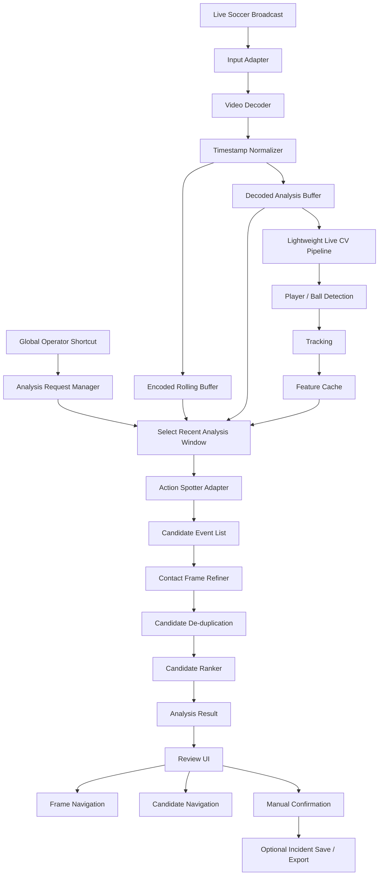
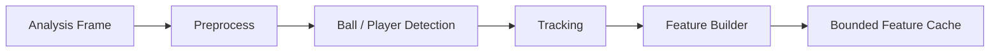
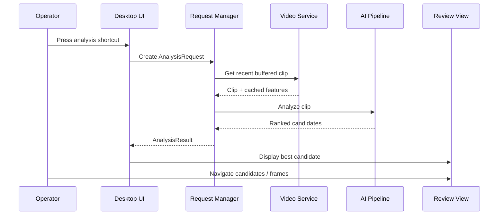
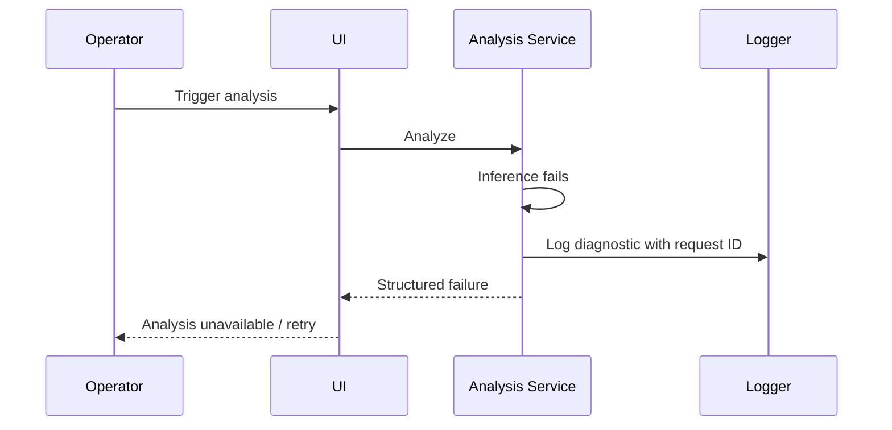
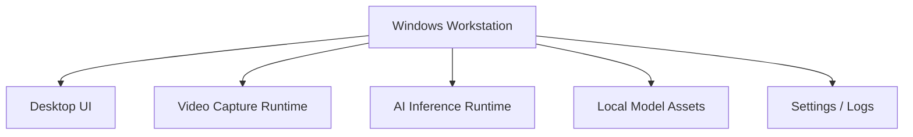
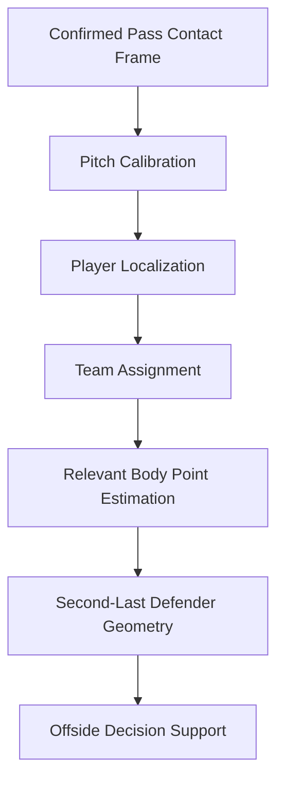

# AI Soccer Broadcast Analysis MVP — Detailed Technical Architecture

## 1. Purpose

This file is the technical source of truth for the coding agent implementing the Windows AI Soccer Broadcast Analysis MVP.

The implementation must produce a **usable Windows analysis tool**, not a notebook, one-off demo, or disposable proof of concept.

The project is intentionally architected around **existing computer-vision models and research**, not around training an entire football vision stack from scratch. Candidate model directions include T-DEED, FOOTPASS/TAAD, and SoccerNet-oriented tracking/game-state components. These models must be evaluated behind common interfaces so the final product is not locked to one research repository.

The coding agent should treat this document as the default architecture unless a later approved decision explicitly overrides it.

---

# 2. Product Definition

The application continuously receives a live soccer broadcast, keeps a recent rolling video window available, performs lightweight background processing, and waits for an operator trigger.

When the operator presses a configured shortcut, the application analyzes the recent play and proposes one or more candidate frames representing important ball-contact actions such as:

- pass
- shot
- cross
- header
- rebound-related contact
- goalkeeper contact
- other supported ball actions

The operator must be able to:

- view the strongest candidate first
- switch between alternative AI candidates
- move backward or forward one frame at a time
- manually choose the final frame
- continue using the live application while analysis runs

This is an **AI-assisted analysis system**. The human operator remains responsible for final frame selection.

---

# 3. MVP Product Positioning

The MVP must be:

- operationally usable
- responsive
- modular
- maintainable
- cost-conscious
- deployable on Windows
- scalable for future features
- capable of source-code handover
- easy to provide as interim builds during development

The MVP must not be treated as a temporary research script.

At the same time, it must avoid unnecessary reinvention. Existing open-source models should be evaluated first, then adapted, fine-tuned, replaced, or combined only where evidence shows this is useful.

No hard performance or accuracy threshold should be assumed in architecture code. All final thresholds should remain configurable and should be validated on representative client footage.

---

# 4. Primary Architecture Principles

## 4.1 UI must never block

Video decoding, AI inference, tracking, export, model loading, and contact refinement must never run on the UI thread.

## 4.2 Memory must remain bounded

No unbounded frame arrays, queues, caches, tensors, or debug images.

## 4.3 Models must be replaceable

The application must not depend directly on T-DEED, FOOTPASS, SoccerNet, or any single model-specific output schema outside its adapter.

## 4.4 Triggered analysis must reuse prior work

The software should continuously prepare useful lightweight data so that pressing the analysis shortcut does not restart all processing from zero.

## 4.5 Expensive analysis should be focused

Do lightweight processing continuously and deeper processing only around likely candidate moments.

## 4.6 The human remains in the loop

Never throw away useful alternative candidates just because one candidate has the highest model score.

## 4.7 Optimize after profiling

Do not add complex optimizations without measurements.

---

# 5. Explicit MVP Non-Goals

Unless later added to scope, do not implement:

- fully autonomous referee decisions
- guaranteed offside decisions
- FIFA-grade pitch calibration
- complete multi-camera VAR
- player facial recognition
- full-match tactical analytics
- complete replay production
- cloud-native distributed inference
- multi-user centralized administration
- automatic legal interpretation of every football situation

The architecture should allow some of these to be added later without rewriting the core product.

---

# 6. High-Level System Architecture



---

# 7. Recommended Repository Structure

```text
soccer-analysis-mvp/
│
├── apps/
│   └── desktop/
│       ├── ui/
│       ├── viewmodels/
│       ├── shortcuts/
│       └── startup/
│
├── core/
│   ├── domain/
│   ├── interfaces/
│   ├── events/
│   ├── config/
│   └── errors/
│
├── video/
│   ├── inputs/
│   ├── decoding/
│   ├── timestamps/
│   ├── buffering/
│   └── frame_access/
│
├── vision/
│   ├── detection/
│   ├── tracking/
│   ├── preprocessing/
│   ├── features/
│   └── scene_analysis/
│
├── ai/
│   ├── action_spotting/
│   │   ├── common/
│   │   ├── tdeed/
│   │   ├── footpass/
│   │   └── soccernet/
│   ├── contact_refinement/
│   ├── candidate_ranking/
│   ├── model_registry/
│   └── inference_runtime/
│
├── analysis/
│   ├── request_manager/
│   ├── pipelines/
│   ├── event_chain/
│   └── results/
│
├── storage/
│   ├── settings/
│   ├── incidents/
│   └── cache/
│
├── observability/
│   ├── logging/
│   ├── metrics/
│   └── diagnostics/
│
├── deployment/
│   ├── windows/
│   ├── packaging/
│   └── model_assets/
│
├── tests/
│   ├── unit/
│   ├── integration/
│   ├── model_evaluation/
│   ├── performance/
│   └── fixtures/
│
├── tools/
│   ├── dataset_preparation/
│   ├── video_sampling/
│   └── model_benchmarking/
│
├── architecture.md
└── README.md
```

The physical layout can change with the chosen language/framework, but these logical boundaries should remain.

---

# 8. Technology Direction

A practical MVP stack is:

## Desktop
- PySide6 / Qt as the simplest path when integrating Python research models

Alternative:
- .NET/WPF or WinUI frontend with a separate Python/native inference service

Do not tightly couple the AI layer to the UI framework.

## AI / CV
- Python
- PyTorch
- OpenCV
- NumPy
- ONNX Runtime where useful
- TensorRT where useful and justified by profiling

## Video
- FFmpeg as the preferred robust decode/capture foundation
- PyAV or controlled FFmpeg process where suitable

## Configuration
- YAML or TOML
- environment variables for machine/deployment-specific values

## Persistence
- local files and optionally SQLite for incidents/settings

## Logging
- structured logs with timestamps, session IDs, request IDs, module names, and model versions

---

# 9. Core Domain Models

Use explicit typed domain objects. Do not pass arbitrary nested dictionaries across the whole system.

## 9.1 FramePacket

```python
@dataclass
class FramePacket:
    frame_id: int
    pts: int | None
    timestamp_ms: int
    capture_timestamp_ms: int
    width: int
    height: int
    source_id: str
    image: np.ndarray | None = None
    is_keyframe: bool = False
```

## 9.2 Detection

```python
@dataclass
class Detection:
    frame_id: int
    class_name: str
    confidence: float
    bbox_xyxy: tuple[float, float, float, float]
    source_model: str
```

## 9.3 TrackObservation

```python
@dataclass
class TrackObservation:
    track_id: str
    frame_id: int
    timestamp_ms: int
    object_type: str
    bbox_xyxy: tuple[float, float, float, float]
    center_xy: tuple[float, float]
    confidence: float
```

## 9.4 ActionCandidate

```python
@dataclass
class ActionCandidate:
    candidate_id: str
    action_type: str
    anchor_frame_id: int
    anchor_timestamp_ms: int
    model_score: float
    source_model: str
    player_track_id: str | None = None
    team_id: str | None = None
    metadata: dict = field(default_factory=dict)
```

## 9.5 RefinedCandidate

```python
@dataclass
class RefinedCandidate:
    candidate_id: str
    action_type: str
    original_frame_id: int
    refined_frame_id: int
    final_score: float
    model_score: float
    contact_score: float
    trajectory_score: float
    proximity_score: float
    temporal_score: float
    evidence: dict
```

## 9.6 AnalysisRequest

```python
@dataclass
class AnalysisRequest:
    request_id: str
    triggered_at_ms: int
    trigger_source: str
    requested_window_ms: int
    request_type: str = "general"
```

## 9.7 AnalysisResult

```python
@dataclass
class AnalysisResult:
    request_id: str
    candidates: list[RefinedCandidate]
    selected_candidate_index: int
    status: str
    warnings: list[str]
    diagnostics: dict
```

---

# 10. Video Input Layer

Every video source must implement one standard interface.

```python
class VideoInput(Protocol):
    def start(self) -> None: ...
    def stop(self) -> None: ...
    def read_packet(self) -> EncodedPacket | None: ...
    def get_stream_info(self) -> StreamInfo: ...
```

Possible adapters:

```text
CaptureCardInput
LocalFileInput
RTSPInput
SRTInput
ScreenCaptureInput
NDIInput
```

Do not put source-specific branching throughout analysis code.

---

# 11. Timestamp and Frame Identity

The application needs one stable timeline.

Use:

```text
source PTS
+ stream time base
+ internal monotonically increasing frame_id
+ capture timestamp
```

Do not rely only on wall-clock time.

Every candidate must be traceable back to a deterministic frame.

Camera/stream discontinuities must be detectable.

---

# 12. Rolling Buffer Architecture

Use two logical buffers.

## 12.1 Encoded Rolling Buffer

Purpose:
- preserve recent original-quality compressed video efficiently
- allow high-quality reconstruction around a selected candidate
- avoid keeping all recent frames as full-resolution RGB

Store:
- encoded packet
- PTS/DTS
- keyframe flag
- stream metadata

## 12.2 Decoded Analysis Buffer

Purpose:
- instant access to frames and AI-ready data

May contain:
- frame ID
- timestamp
- downscaled image
- detections
- tracks
- lightweight features

All buffers must have explicit limits and automatic eviction.

Example interface:

```python
class RecentVideoBuffer(Protocol):
    def append(self, item) -> None: ...
    def get_by_frame(self, frame_id: int): ...
    def get_window(self, end_timestamp_ms: int, duration_ms: int) -> list: ...
    def get_range(self, start_frame_id: int, end_frame_id: int) -> list: ...
```

---

# 13. Live CV Pipeline



The amount of continuous processing must be configurable.

Do not run expensive high-resolution analysis continuously if focused analysis can produce the same useful result after a trigger.

---

# 14. Detection Interface

```python
class ObjectDetector(Protocol):
    @property
    def model_name(self) -> str: ...

    def detect(self, frame: FramePacket) -> list[Detection]:
        ...
```

Likely object types:

- player
- goalkeeper
- ball
- referee

A generic `sports ball` detector must not be assumed accurate enough without client-footage validation.

Football ball detection is difficult because the ball may be tiny, blurred, occluded, or confused with field/graphic features.

Keep the detector replaceable.

---

# 15. Tracking Interface

```python
class MultiObjectTracker(Protocol):
    def update(
        self,
        frame: FramePacket,
        detections: list[Detection],
    ) -> list[TrackObservation]:
        ...

    def reset(self) -> None:
        ...
```

Potential trackers include ByteTrack, BoT-SORT, OC-SORT, and SoccerNet-compatible approaches.

Ball tracking may need separate logic from player tracking.

Never estimate ball velocity across a detected camera cut.

---

# 16. Feature Cache

Reuse previous work.

Possible cached features:

```text
player boxes
player track IDs
ball location
ball confidence
ball velocity
ball acceleration
nearest player
camera-motion estimate
scene-cut flag
action-model embeddings
local crops
```

Example:

```python
@dataclass
class FrameFeatures:
    frame_id: int
    timestamp_ms: int
    ball_center: tuple[float, float] | None
    ball_confidence: float | None
    nearest_player_track_id: str | None
    ball_velocity: tuple[float, float] | None
    ball_speed: float | None
    scene_cut: bool
    model_features: dict[str, np.ndarray]
```

Feature storage must remain bounded.

---

# 17. Global Operator Shortcut

The analysis key must be configurable, not hard-coded.

Example:

```yaml
shortcuts:
  analyze_recent_play: "F8"
```

When triggered:

1. create unique `request_id`
2. record current normalized video timestamp
3. identify the recent buffer window
4. queue an `AnalysisRequest`
5. notify UI that analysis has started
6. run asynchronously
7. return an `AnalysisResult`

Repeated shortcuts must not corrupt shared buffers or results.

---

# 18. Analysis Request State Machine

Use explicit states:

```text
CREATED
QUEUED
PREPARING
SPOTTING_ACTIONS
REFINING
RANKING
COMPLETED
FAILED
CANCELLED
```

The request manager is responsible for:

- queuing
- request priority
- cancellation policy
- buffer-window selection
- preserving completed results
- progress events
- error translation

---

# 19. Common Action Spotter Interface

Every candidate model must implement:

```python
class ActionSpotter(Protocol):
    @property
    def model_name(self) -> str: ...

    @property
    def supported_actions(self) -> set[str]: ...

    def warmup(self) -> None: ...

    def infer(self, clip: AnalysisClip) -> list[ActionCandidate]:
        ...
```

Required adapters:

```text
TDeedActionSpotter
FootpassActionSpotter
SoccerNetActionSpotter
```

The rest of the application must only consume `ActionCandidate`.

Do not expose raw model-specific tensors or schemas outside the adapter.

---

# 20. Model Registry

```python
class ModelRegistry:
    def get_action_spotter(self) -> ActionSpotter: ...
    def get_detector(self) -> ObjectDetector: ...
    def get_tracker(self) -> MultiObjectTracker: ...
```

Example configuration:

```yaml
ai:
  action_spotter:
    provider: "tdeed"

  providers:
    tdeed:
      checkpoint: "./models/tdeed/model.pt"

    footpass:
      checkpoint: "./models/footpass/model.pt"

    soccernet:
      checkpoint: "./models/soccernet/model.pt"
```

Model version and asset hash should be recorded in diagnostics.

---

# 21. Model Evaluation Strategy

Do not choose a production model by reputation alone.

Evaluate T-DEED, FOOTPASS/TAAD, and SoccerNet-oriented approaches on the same representative client footage.

Benchmark scenarios should include:

- simple pass
- long pass
- deep cross
- shot
- blocked shot
- goalkeeper save
- rebound
- second shot after rebound
- crowded box
- ball occlusion
- fast camera pan
- zoom
- replay
- broadcast cut
- overlay/graphic
- lower-quality stream
- motion blur

## Practical comparison categories

### Candidate retrieval
- Top-1 correct-action rate
- Top-3 correct-action inclusion
- Top-K recall

### Temporal quality
- absolute frame error
- median frame error
- tolerance-based inclusion using configurable tolerance

### Runtime
- model inference duration
- contact-refinement duration
- frame reconstruction duration
- CPU/GPU/RAM utilization

### Stability
- failure count
- repeated-trigger behavior
- long-session behavior
- recovery after stream interruption

Research-paper metrics can be recorded, but client-footage behavior is more important.

---

# 22. Model Benchmark Harness

Create one reproducible benchmark runner.

Example:

```bash
python -m tools.model_benchmarking.run   --dataset ./evaluation/client_clips   --models tdeed footpass soccernet   --output ./reports/model_comparison.json
```

The report should include:

```text
per-model results
per-scenario results
candidate recall
frame error
runtime
memory consumption
failure count
```

Do not compare models using isolated manual scripts.

---

# 23. Candidate Action Detection

Triggered inference should return several candidate actions.

Example:

```json
[
  {
    "action": "shot",
    "frame_id": 18234,
    "score": 0.88
  },
  {
    "action": "goalkeeper_contact",
    "frame_id": 18248,
    "score": 0.74
  },
  {
    "action": "shot",
    "frame_id": 18261,
    "score": 0.71
  }
]
```

Do not discard candidates merely because they are not ranked first.

---

# 24. Contact-Frame Refinement

The action model may find an approximate action moment. A dedicated local refinement stage must search around that anchor.

Example:

```text
Action anchor = frame 18234

Refinement neighborhood:
18224 ... 18244
```

The exact neighborhood is configurable.

Useful evidence:

- player-ball proximity
- ball speed change
- ball acceleration
- ball direction change
- player motion
- track consistency
- model confidence curve
- local optical flow when useful

Conceptual score:

```text
final_contact_score =
    w_model      * action_model_score
  + w_proximity  * proximity_score
  + w_velocity   * velocity_change_score
  + w_direction  * direction_change_score
  + w_motion     * player_motion_score
  + w_track      * tracking_consistency_score
```

Weights must not be permanently buried inside implementation code.

---

# 25. Missing Ball Handling

The ball will not be visible in every frame.

The pipeline must tolerate short gaps.

Possible strategies:

- short-gap interpolation
- motion prediction
- local optical flow
- predicted-region search
- player-local crop search
- confidence reduction
- fall back to the action-model anchor

Do not fail the complete analysis merely because one or several ball detections are missing.

---

# 26. Camera Cut Handling

On detected camera cut:

- break trajectory continuity
- reset or segment tracker state
- do not compute velocity across the cut
- mark continuity confidence lower
- treat the next scene as a new segment

```python
if scene_cut:
    tracker.start_new_segment()
    ball_trajectory.reset()
```

---

# 27. Broadcast Scene Handling

Broadcast footage may contain:

- wide gameplay
- close-up player shots
- manager/bench
- crowd
- replay
- overlays
- transitions
- scoreboard graphics

A scene-state component may expose:

```python
@dataclass
class SceneState:
    is_gameplay: bool
    is_replay: bool
    is_closeup: bool
    has_major_graphic: bool
    confidence: float
```

The system may lower candidate priority for non-gameplay segments, but replay behavior must remain configurable until confirmed with the client.

---

# 28. Event-Chain Reasoning

Example:

```text
Cross
 ↓
Shot A
 ↓
Goalkeeper Save
 ↓
Rebound
 ↓
Shot B
 ↓
Goal
```

Do not assume the last contact is always the client's desired frame.

Keep temporally ordered candidates.

```python
@dataclass
class EventChain:
    events: list[RefinedCandidate]
```

The initial MVP can use generic ranking plus alternative candidate navigation.

Future request modes may include:

```text
original shot
latest attacking contact
last pass
cross before shot
goal-origin action
```

---

# 29. Candidate De-duplication

Models may emit multiple nearby detections for one real action.

Cluster candidates using:

- temporal distance
- action type
- player track
- confidence-curve shape

Example:

```text
1201 pass
1202 pass
1203 pass
1204 pass
```

should normally become one refined candidate, not four user-visible candidates.

---

# 30. Candidate Ranking

Candidate ranking may combine:

- action-model score
- contact evidence
- trajectory quality
- ball visibility
- track quality
- scene quality
- temporal relevance
- event-chain context

Interface:

```python
class CandidateRanker:
    def rank(
        self,
        candidates: list[RefinedCandidate],
        context: AnalysisContext,
    ) -> list[RefinedCandidate]:
        ...
```

Return an ordered list, not just one result.

---

# 31. Review UI Requirements

Recommended components:

```text
MainWindow
├── LiveVideoPanel
├── StreamStatus
├── ModelStatus
├── AnalysisStatus
├── CandidateReviewPanel
│   ├── FrameView
│   ├── CandidateNumber
│   ├── ActionLabel
│   ├── CandidateMetadata
│   ├── CandidateNavigation
│   └── FrameNavigation
├── SettingsDialog
└── DiagnosticsPanel
```

Required review actions:

```text
previous frame
next frame
previous candidate
next candidate
jump to best candidate
confirm current frame
retry analysis
```

Frame navigation and candidate navigation must use separate commands.

---

# 32. UI Event Model

The UI should react to events/signals.

Examples:

```text
StreamStarted
StreamStopped
StreamError

ModelsLoading
ModelsReady
ModelError

AnalysisQueued
AnalysisStarted
AnalysisProgress
AnalysisCompleted
AnalysisFailed

CandidateChanged
FrameChanged
CandidateConfirmed
```

The UI should not reach into worker internals to poll mutable state.

---

# 33. Concurrency Model

The UI thread handles only UI work.

Logical workers:

```text
UI event loop
Video ingest/decoder worker
Live detection worker
Tracking/feature worker
Triggered action-inference worker
Contact-refinement worker
Export/persistence worker
```

GPU tasks should be coordinated by a controlled inference scheduler.

Do not create arbitrary parallel GPU threads.

---

# 34. Inference Scheduler

Possible priorities:

```text
HIGH     triggered action analysis
MEDIUM   contact refinement
LOW      continuous background feature work
```

Conceptual API:

```python
class InferenceScheduler:
    async def submit(
        self,
        job: InferenceJob,
        priority: InferencePriority,
    ) -> InferenceResult:
        ...
```

If required, background inference may temporarily reduce frequency during a user-triggered analysis.

---

# 35. Backpressure Rules

All processing queues must be bounded.

For live frames:
- stale analysis frames may be dropped
- video ingest must not block forever

For explicit analysis requests:
- preserve operator intent
- define whether older queued requests are cancelled or processed

Queue limits must be configuration-driven.

---

# 36. Memory Rules

The implementation must:

1. bound all rolling buffers
2. evict old features
3. avoid accidentally holding GPU computation graphs
4. detach/copy only when necessary
5. avoid storing unlimited debug images
6. reuse buffers where practical
7. write exports asynchronously
8. test memory usage over long sessions

Full-match runtime must not cause continuous memory growth.

---

# 37. GPU Runtime Rules

Models should:

- load once
- warm up before normal operation
- use inference mode
- use mixed precision only after validation
- use ONNX/TensorRT only if measured benefit justifies it
- avoid unnecessary device transfers
- share preprocessing where possible

Do not load model weights whenever the operator presses the shortcut.

---

# 38. Model Readiness

Application states may include:

```text
Loading models
Warming up
Ready
Unavailable
```

The operator should know whether AI analysis is ready.

The UI should still open even if the GPU/model fails, where graceful degradation is possible.

---

# 39. Configuration

Illustrative configuration:

```yaml
application:
  name: "Soccer Analysis MVP"

video:
  input_type: "capture_card"
  analysis_resolution:
    width: 960
    height: 540

buffer:
  recent_window_seconds: 20

shortcuts:
  analyze: "F8"
  previous_frame: "Left"
  next_frame: "Right"
  previous_candidate: "Up"
  next_candidate: "Down"

ai:
  action_spotter: "tdeed"

  contact_refinement:
    enabled: true
    window_before_frames: 12
    window_after_frames: 12

runtime:
  device: "cuda"
```

All values are examples, not fixed product promises.

---

# 40. Analysis Pipeline Pseudocode

```python
async def analyze_recent_play(request: AnalysisRequest) -> AnalysisResult:

    clip = video_service.get_recent_clip(
        end_timestamp_ms=request.triggered_at_ms,
        duration_ms=request.requested_window_ms,
    )

    candidates = await inference_scheduler.submit(
        ActionSpottingJob(clip),
        priority=HIGH,
    )

    candidates = deduplicate_candidates(candidates)

    refined = []

    for candidate in candidates:
        context = build_refinement_context(
            candidate=candidate,
            frame_buffer=frame_buffer,
            feature_cache=feature_cache,
        )

        refined_candidate = contact_refiner.refine(
            candidate,
            context,
        )

        refined.append(refined_candidate)

    ranked = candidate_ranker.rank(
        refined,
        context=build_analysis_context(request, clip),
    )

    return AnalysisResult(
        request_id=request.request_id,
        candidates=ranked,
        selected_candidate_index=0,
        status="COMPLETED",
        warnings=[],
        diagnostics={}
    )
```

---

# 41. Trigger Sequence



---

# 42. Failure Flow



The live stream should remain running where possible.

---

# 43. Persistence

Keep persistence simple in the MVP.

Possible stored information:

- settings
- model selection
- input configuration
- diagnostics metadata
- optional saved incidents

SQLite is sufficient if local incident metadata is required.

Do not introduce a network database without an actual requirement.

---

# 44. Optional Incident Model

```python
@dataclass
class Incident:
    incident_id: str
    match_session_id: str
    trigger_timestamp_ms: int
    selected_frame_id: int
    selected_timestamp_ms: int
    action_type: str | None
    source_model: str
    confidence: float | None
    created_at: datetime
    metadata: dict
```

Possible exported assets:

```text
selected frame image
short video clip
JSON metadata
```

Only implement save/export if confirmed in MVP scope.

---

# 45. Observability

Use structured logging.

Important events:

```text
application_started
hardware_detected
model_loading
model_ready
stream_connected
stream_disconnected
decoder_error
resolution_changed
analysis_requested
analysis_started
action_spotting_completed
refinement_completed
analysis_completed
analysis_failed
gpu_out_of_memory
export_failed
application_stopped
```

Every analysis-related log should include `request_id`.

Every model result should record model name/version.

---

# 46. Useful Metrics

Capture:

```text
input FPS
decoded FPS
processed FPS
dropped analysis frames
buffer duration
buffer memory
detector runtime
tracking runtime
action-spotter runtime
refinement runtime
candidate count
GPU memory
CPU utilization
RAM utilization
analysis failures
```

These belong mainly in diagnostics, not the normal operator UI.

---

# 47. Error Handling

Define explicit application/domain exceptions.

```python
class StreamUnavailableError(Exception):
    pass

class ModelInferenceError(Exception):
    pass

class AnalysisWindowUnavailableError(Exception):
    pass
```

Detailed technical information goes to logs.

UI-facing messages should remain understandable.

Example:

```text
AI analysis could not complete.
The live video is still available.
Please retry the analysis.
```

---

# 48. Stream Recovery

When a stream fails:

1. mark stream unhealthy
2. keep UI responsive
3. stop consuming invalid packets
4. attempt configured recovery
5. reset decoder/tracker state if necessary
6. create a safe new timeline segment
7. notify UI when ready again

Do not crash the whole application because one input fails.

---

# 49. Graceful Degradation

Where practical:

```text
GPU unavailable
→ application opens
→ live preview can still work
→ AI shown as unavailable

action model failure
→ retain buffered video
→ allow manual review if implemented
```

This is better than refusing to start the application.

---

# 50. Testing Strategy

## Unit Tests

Test:

- ring-buffer eviction
- timestamp normalization
- request state transitions
- candidate de-duplication
- ranking
- score calculations
- event-chain ordering
- configuration
- error mapping

## Integration Tests

Test:

```text
video fixture
→ decoder
→ buffer
→ request
→ mocked action spotter
→ refiner
→ ranker
→ result
```

## Model Evaluation Tests

Use labeled clips.

Example:

```yaml
clip: rebound_goal_001.mp4

expected:
  actions:
    - type: shot
      frame: 322
    - type: goalkeeper_contact
      frame: 340
    - type: shot
      frame: 371
```

## Performance/Stability Tests

Test:

- long-running match duration
- repeated triggers
- memory growth
- GPU memory behavior
- stream interruption/recovery
- bounded queue behavior
- dropped-frame behavior
- model warmup/cold start

## UI Tests

Test:

- shortcut
- candidate navigation
- frame navigation
- stream status
- model status
- analysis status
- failure messages
- configuration persistence

---

# 51. Data Collection and Fine-Tuning

If client-approved footage is available, use a consistent annotation schema.

```json
{
  "video": "match_clip_01.mp4",
  "events": [
    {
      "frame": 1043,
      "type": "pass",
      "notes": "deep cross"
    }
  ]
}
```

Useful difficulty tags:

```text
occluded_ball
camera_pan
camera_cut
rebound
deep_cross
crowded_box
motion_blur
low_resolution
```

Do not start expensive custom training immediately.

Recommended sequence:

1. integrate baseline model
2. test representative footage
3. classify failures
4. identify whether failure is caused by:
   - action spotting
   - detection
   - tracking
   - contact refinement
   - ranking
5. improve only the failing component

---

# 52. Deployment Architecture

Initial deployment target:

```text
Windows workstation
+
local desktop app
+
local video capture/decode
+
local AI inference
+
local model assets
+
local settings/logs
```



Cloud should not be required unless later requested.

---

# 53. Windows Packaging

Possible packaging for a Python-first implementation:

- PyInstaller
- Nuitka
- an installer wrapper such as Inno Setup

Large model files can remain external to the main executable.

Example:

```text
SoccerAnalysis/
├── SoccerAnalysis.exe
├── runtime/
├── models/
├── config/
├── logs/
└── docs/
```

---

# 54. Model Asset Management

Model assets should have their own manifest.

```json
{
  "model_id": "action-spotter-v1",
  "provider": "tdeed",
  "version": "1.0",
  "sha256": "...",
  "runtime": "onnx"
}
```

This prevents ambiguity over which model generated a result.

---

# 55. Open-Source Licensing

Before commercial packaging:

- verify code license
- verify model/checkpoint license
- verify dataset restrictions
- document attribution
- avoid distributing restricted assets
- keep adapters replaceable

A model may be acceptable for R&D evaluation but unsuitable for final commercial distribution.

Do not let licensing assumptions become architectural dependencies.

---

# 56. Client Development Visibility

The system should be buildable throughout development.

Possible progress access:

- regular Windows test builds
- milestone demos
- benchmark reports
- shared issue/task board
- agreed repository/staging access
- recorded demonstrations

Do not keep the project as developer-only command-line code until the final week.

---

# 57. Development Phases

## Phase 1 — Foundation

Implement:

- repository structure
- configuration
- logging
- hardware diagnostics
- video input abstraction
- decoder
- rolling buffers
- desktop preview
- global shortcut
- request state machine

## Phase 2 — Model Benchmarking

Implement common adapters for candidate approaches.

Output:
- reproducible model-comparison report

Select the primary model using representative footage.

## Phase 3 — Live CV Integration

Implement:

- selected action spotter
- player/ball detector
- tracking
- feature cache
- inference scheduler
- trigger-based analysis

## Phase 4 — Contact Refinement

Implement:

- trajectory features
- proximity features
- local contact scoring
- de-duplication
- event-chain handling
- candidate ranking

## Phase 5 — Review UI

Implement:

- best candidate display
- alternatives
- frame navigation
- candidate navigation
- analysis status
- retry/failure behavior

## Phase 6 — Stabilization

Focus on:

- long-session reliability
- bounded memory
- GPU behavior
- queue backpressure
- stream recovery
- packaging
- diagnostics
- maintainability

## Phase 7 — Handover

Provide:

- source code
- packaged application
- legally distributable model/configuration assets
- setup guide
- operator guide
- architecture documentation
- model evaluation summary

---

# 58. Coding Rules for the Agent

The coding agent must follow these rules.

1. **Do not build the whole product in one file.**
2. **Do not couple the product to one AI model.**
3. **Do not perform decode or inference on the UI thread.**
4. **Do not use unbounded queues, frame lists, or caches.**
5. **Do not reload models for every analysis trigger.**
6. **Do not reprocess the full match when recent buffered data is sufficient.**
7. **Do not return only one candidate if useful alternatives exist.**
8. **Do not assume ball detection exists on every frame.**
9. **Do not calculate motion across camera cuts.**
10. **Do not mix Qt/UI code with model-specific inference code.**
11. **Do not hard-code shortcuts, model names, input source, or tuning values.**
12. **Every analysis request needs a unique request ID.**
13. **Every model result must record model/version.**
14. **Write unit tests for pure logic before GUI integration.**
15. **Use one common benchmark harness for all candidate models.**
16. **Optimize after profiling, not by guesswork.**
17. **UI must remain usable when AI fails.**
18. **Document major architectural deviations before implementing them.**
19. **Prefer clear interfaces over shared mutable global state.**
20. **Never silently hide model failures or licensing constraints.**

---

# 59. Internal Service Interfaces

## Video Service

```python
class VideoService:
    def start(self) -> None: ...
    def stop(self) -> None: ...

    def get_recent_clip(
        self,
        end_timestamp_ms: int,
        duration_ms: int,
    ) -> AnalysisClip:
        ...

    def get_frame(
        self,
        frame_id: int,
        quality: str = "analysis",
    ) -> FramePacket:
        ...
```

## Analysis Service

```python
class AnalysisService:
    async def analyze_recent_play(
        self,
        request: AnalysisRequest,
    ) -> AnalysisResult:
        ...
```

## Contact Refiner

```python
class ContactRefiner:
    def refine(
        self,
        candidate: ActionCandidate,
        context: RefinementContext,
    ) -> RefinedCandidate:
        ...
```

## Candidate Ranker

```python
class CandidateRanker:
    def rank(
        self,
        candidates: list[RefinedCandidate],
        context: AnalysisContext,
    ) -> list[RefinedCandidate]:
        ...
```

---

# 60. Future Offside Extension

Reserve a future module boundary:

```text
offside/
├── pitch_calibration/
├── field_geometry/
├── team_assignment/
├── body_keypoints/
├── second_last_defender/
└── offside_line/
```

Future flow:



Do not implement this in the initial MVP unless scope changes.

---

# 61. Questions That Must Remain Configurable or Be Confirmed

Confirm with the client before hard implementation assumptions:

1. live video source type
2. expected broadcast frame rate/resolution
3. target Windows hardware
4. primary action classes
5. replay handling
6. rebound ranking behavior
7. whether incident saving is required
8. whether export is required
9. keyboard mapping
10. fully offline requirement
11. expected variation across broadcasters/leagues
12. future automatic offside requirement

Until confirmed, isolate each behind configuration or interfaces.

---

# 62. Definition of Done

The MVP architecture is considered properly implemented when:

- the Windows app starts reliably
- input is opened through a source adapter
- recent video is retained in bounded buffers
- the UI remains responsive
- the operator can trigger analysis
- AI models are loaded through the registry
- action candidates are returned through a common schema
- contact refinement can adjust candidate frames
- duplicate candidates are consolidated
- candidates are ranked
- alternative candidates remain available
- frame-by-frame navigation works
- candidate navigation works
- failures are logged and displayed cleanly
- configuration is externalized
- model implementations are replaceable
- evaluation can run independently of the UI
- memory remains bounded over extended use
- the application can be packaged for Windows
- interim test builds can be delivered
- source code and documentation can be handed over

---

# 63. Final Implementation Principle

The core philosophy is:

> **Build a responsive Windows analysis product around reusable AI components, not a research model wrapped in a GUI.**

The complete system is:

```text
robust video ingest
+
timestamp-safe rolling buffers
+
efficient background CV
+
replaceable action models
+
custom contact-frame refinement
+
candidate de-duplication
+
candidate ranking
+
human review
+
responsive Windows UI
+
diagnostics
+
deployment
```

The MVP should solve the immediate frame-analysis workflow while creating a clean foundation for a larger football-analysis platform.
