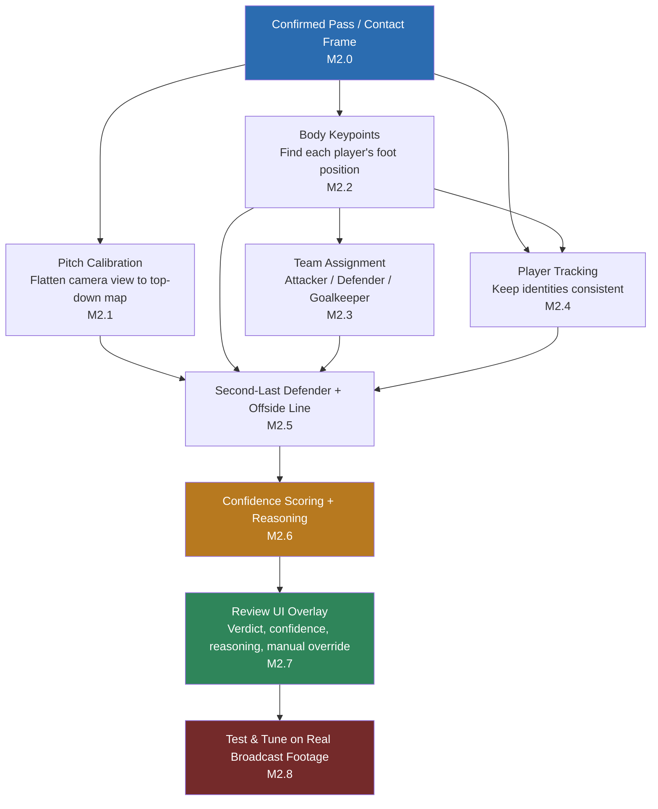

# Milestone 2 (M2) — Offside Detection Implementation Plan

## Application name: **RefEye** (be consistent everywhere)

## 1. What is this milestone, in plain words

Milestone 1 built the "find the right moment" tool: press a hotkey, the app looks at the last few seconds, and shows the operator the exact frame where a player passed, shot, or crossed the ball.

Milestone 2 adds a new brain on top of that: once the operator has picked the pass, **the app tries to figure out on its own whether that pass was offside**, and shows *why* it thinks so — not just a yes/no.

Important ground rule the client gave us: **the app does not need to be perfect**. A rough-but-honest answer is acceptable, as long as it always:
1. Points at roughly the right moment/players, and
2. Clearly says what it was confident about and what it couldn't check (bad angle, players too close together, camera too zoomed out, etc.), so the human operator can make the final call.

This means we are **not** building broadcast-grade VAR. We are building a **decision-support assistant that shows its own reasoning**, the same way a junior assistant referee might say "I think it's close, here's what I saw, you decide."

## 2. The rule we're teaching the computer (offside, explained simply)

Offside is judged at **one single freeze-frame**: the instant a teammate touches the ball to pass/shoot it forward. At that exact instant, look at the attacking player who's about to receive the ball:

- Are they standing in the opponent's half of the pitch?
- Are they standing **closer to the opponent's goal line** than *both* (a) the ball, and (b) the **second-last opponent player** (normally the last defender, since the goalkeeper is usually the actual last one — but not always)?

If both are true → offside. If the attacker is level with or behind that defender, or behind the ball, or in their own half → not offside.

Everything in this plan exists to answer one question as reliably as we can: *"at the contact frame, where exactly is everyone standing, relative to each other and the goal line?"*

## 3. Why this is harder than Milestone 1

Milestone 1 only had to find *when* something happened. Milestone 2 has to find *exactly where, in real pitch space,* several different people were standing at that instant — using a camera that isn't looking straight down at the pitch, cuts angles, zooms, and sometimes hides players behind each other. That "where" question is answered by chaining several separate AI/CV steps together, each one imperfect on its own, which is why this is treated as its own R&D phase rather than a quick add-on.

## 4. Reference Test Footage & Generalization Requirement

**Current development/testing is done against one client-provided clip:** `data/videos/client_m2_test_video.mp4` (1280x720, H.264, 30fps, ~13.8s). This is **not a live broadcast feed** — M2 work right now happens against this one recorded file, playing it back like any other local video source (same `LocalFileInput` path M1 already uses).

**This is a development/reference clip only — it must not become the design target.** Every model and threshold chosen in this plan (pitch-keypoint detector, pose model, team-color clustering, refinement weights, etc.) must be built to generalize across broadcast footage in general — different stadiums, camera rigs, kit colors, lighting, broadcaster graphics overlays — not tuned to look good specifically on this one clip. A pipeline that only works on `client_m2_test_video.mp4` and breaks on any other match footage would make the tool useless to the client, since the whole point is analyzing footage the client hasn't necessarily pre-selected or cleaned up. Concretely:

- Do not hardcode this file's resolution, camera angle, kit colors, or pitch-line visibility into any module — everything tunable stays in `config/`, per the existing cross-cutting rule (section 6 below).
- Treat this clip as the first entry in what should become a small evaluation set (see M2.8) — more real clips, ideally from different matches/broadcasts, should be added before any accuracy claims are made.
- When a phase's difficulty rating says "unpredictable on real broadcast footage" (M2.1, M2.8), assume this single reference clip is not sufficient evidence that the phase works — it only proves the code runs, not that it generalizes.

## 5. Scope Boundaries for M2

**In scope:**
- Making Milestone 1's "moment of contact" detection trustworthy (real model, not the placeholder heuristic it currently falls back to).
- Turning the camera's angled view of the pitch into a flat, top-down map (pitch calibration).
- Finding each player's precise foot position, not just a bounding box (pose estimation).
- Working out who is attacking, who is defending, and who is the goalkeeper.
- Keeping track of "who is who" across the clip so the right player is measured.
- Computing the offside line and the decision (offside / not offside / inconclusive).
- A confidence score and a plain-language reasoning trail for every decision.
- Wiring the result into the existing review UI (the panel built in M1) as an overlay + explanation, with manual override always available to the operator.

**Explicitly out of scope for M2:**
- Multi-camera 3D reconstruction (professional VAR hardware setup) — we use the single broadcast camera feed only.
- Automatic re-calibration mid-broadcast without any operator correction option — a manual "fix the pitch lines" fallback is allowed if auto-calibration fails.
- Rule exceptions that require football judgment, not geometry (interfering with play, active/passive involvement, deliberate play by a defender). The tool flags the geometric offside/onside call only; the operator applies these judgment exceptions.
- Full accuracy benchmarking / certification against real VAR footage — that would be a follow-on validation milestone once this pipeline exists.

## 6. Phase Breakdown

Each phase lists: what it does (plain words), what it touches (for the coding agent), difficulty, and what it depends on.

### Phase M2.0 — Make the "moment of contact" real, not a placeholder

**STATUS: ALREADY IMPLEMENTED — verified 2026-09-05.** Read this before touching this phase again.

**Plain words:** Everything in this milestone is measured relative to the exact pass frame. This phase was originally written assuming the app was still quietly falling back to a rough guess (a "kinematic heuristic") because the real model's files were never installed. That assumption turned out to be stale — the real checkpoint is already installed and wired in, and it loads and runs correctly.

**What was verified, concretely:**
- `models/tdeed/checkpoint_best.pt` (real SoccerNetBall_challenge1 weights, ~49.5MB) is present on disk.
- `config/default.yaml` already has `ai.action_spotter.provider: "tdeed"` (not `kinematic`) and `ai.detector.provider: "yolo"` (not `fixture`).
- Loading `ai/model_registry/registry.py`'s `ModelRegistry` with real settings produces `status = ModelStatus.READY`, `warnings = []` — no degradation, no fallback to the kinematic spotter or the synthetic fixture detector. Both YOLO detector and T-DEED spotter loaded and warmed up successfully on CUDA.
- `tests/integration/test_tdeed_adapter.py` — all 7 tests pass, including strict (`strict=True`) checkpoint loading (proves the vendored architecture genuinely matches the weights) and correct frame-alignment on padded sliding windows.

**⚠️ Important gotcha for any agent picking this up on a fresh clone/machine:** the checkpoint files (`models/tdeed/checkpoint_best.pt`, `models/detector/yolo11n.pt`) are **gitignored** (`.gitignore` line 13: `models/**/*.pt`) — they exist locally but are **not committed to git**. `git status` will never show them. If the registry falls back to `kinematic`/`fixture` on a different machine or a fresh checkout, the first thing to check is whether these weight files are actually present locally, not whether the integration code is broken — the code is confirmed working. These files need to be distributed separately (release asset, shared drive, etc.) when handing off or setting up a new environment.

**Touches:** `ai/action_spotting/tdeed/adapter.py`, model asset manifest (`deployment/model_assets`), `ai/contact_refinement/refiner.py` tuning.

**Difficulty:** Medium — the integration code already exists from M1, this is mostly about installing/validating real model weights and re-tuning refinement, not building new architecture. **(Now done — remaining work under this phase is limited to refinement tuning against real client footage, which is really an M2.8 concern.)**

**Depends on:** Nothing (this is finishing M1 work). Everything else in M2 depends on this, since a wrong contact frame makes every later step measure the wrong moment.

---

### Phase M2.1 — Flatten the camera view into a top-down pitch map (pitch calibration)

**STATUS: IMPLEMENTED (manual path reliable, automatic path partial) — 2026-09-05.** Read this whole entry before extending it; it records what was tried and failed.

**Plain words:** The camera looks at the pitch from an angle, like looking at a table from across the room. We can't measure "who's closer to the goal line" from that angled view directly — we first need to mathematically flatten it into a map, like looking straight down from above, using the pitch's own painted lines (touchlines, penalty box, center circle) as reference points.

**What was built:**

- `offside/field_geometry/pitch.py` — the pitch as a fixed reference: dimensions from config (105×68 default), ~30 named landmarks in metres, and the painted lines for drawing a top-down map. Penalty area / goal area / centre circle are fixed by the Laws and derived in code, deliberately *not* config, so a typo can't silently distort every calibration.
- `offside/pitch_calibration/homography.py` — the maths: solve image↔pitch from point correspondences, project both ways, reprojection error, and the goal-line **vanishing point**.
- `offside/pitch_calibration/line_detection.py` — classical detection of painted markings, plus vanishing-point estimation by consensus.
- `offside/pitch_calibration/calibrator.py` — the orchestrator, reporting a **capability level** rather than a pass/fail.
- Config under `offside.pitch_calibration`; tests: 23 unit (synthetic camera, exact answers) + 7 real-footage integration. All pass.

**⚠️ The key concept — three capability levels, not "calibrated / not calibrated":**

| level | means | comes from |
|---|---|---|
| `NONE` | nothing usable — say so, don't guess | too few markings |
| `DIRECTIONAL` | the goal-line vanishing point is known, so an **offside line can be drawn through any player** — but nobody's position in metres is known, and "is the attacker in their own half?" can't be answered | automatic |
| `METRIC` | full homography: metres, top-down map, half checks | **operator marks 4+ landmarks** |

`DIRECTIONAL` is worth the extra concept because it is *most of offside*: the judgement is "is this attacker beyond that defender along the goal-line direction", and a vanishing point answers that without a metric map. It also needs far less evidence — two parallel markings anywhere in frame, versus four identified landmarks.

**⚠️ What does NOT work automatically (do not re-attempt expecting different results):**

1. **"Lines parallel to the goal line look steep."** True for a halfway-line camera; **false on the reference clip**, where the camera sits off to one side and the penalty-area front line reads as a shallow diagonal. Absolute image angle carries no reliable pitch semantics. Line families are therefore grouped by what they *converge on*, not by how they look.
2. **Brightness alone finds pitch lines.** It finds advertising boards and white shirts far more strongly. Three filters were needed, each removing a measured impostor: grass containment (**eroded**, not dilated — dilation swallows the hoardings directly above the touchline), a **top-hat** filter keeping only thin bright structures, and **player-box exclusion** (a white shirt is a thin bright object on green — before this filter, *every* "steep line" found was a player).
3. **Don't erode the line mask.** Paint is 1-3px wide at this framing; a 3×3 opening deleted most of it and cut a frame from ~43 usable segments to 4.

**So: identifying *which* line is the 16.5m line vs the six-yard line is unsolved here**, and that's the gap between DIRECTIONAL and METRIC. The automatic path caps its confidence at 0.4 and emits an explicit warning that the goal-line group is an assumption. **The operator confirming the group (one dropdown click in the debug UI) or marking 4 landmarks is the reliable route today.** The upgrade that would make this automatic and metric is a learned pitch-keypoint model (SoccerNet-style calibration dataset/baselines) — it drops in behind the same `PitchCalibrator` interface without touching anything downstream.

**Touches:** New modules `offside/pitch_calibration/`, `offside/field_geometry/`; `core/config/schema.py`, `config/default.yaml`.

**Difficulty:** Hard — broadcast cameras cut angles and zoom constantly, so this can't be calibrated once per video; it may need to be re-done whenever the shot changes, and pitch lines can be partly hidden by players or shadow. **(Confirmed: the geometry and the manual path are solid; automatic landmark *identification* is the part that remains hard and is honestly reported as such rather than guessed.)**

**Depends on:** Nothing directly (it works off any frame near the contact moment), but its *output* is required by every geometry step later (M2.4, M2.5, M2.6). Can be built in parallel with M2.2/M2.3.

**Note for M2.5:** consume `PitchCalibration.offside_line_through(point)` — it works at both METRIC and DIRECTIONAL level and returns `None` when the frame can't support a line, so the "inconclusive" path is already wired. Check `is_metric` before asking for metres.

---

### Phase M2.2 — Find each player's exact foot position, not just a rough box

**STATUS: IMPLEMENTED — 2026-09-05.** Read this before extending it.

**Plain words:** A normal player-detector draws a rectangle around a whole player. But offside is decided by *feet* (the body part closest to the goal line), and a player's foot can be far from the center of that rectangle — think of a player mid-stride with their leg stretched out. We need a smarter model that finds actual body points (head, shoulders, hips, feet), not just a box.

**What was built:**

- `offside/body_keypoints/keypoints.py` — COCO-17 keypoint vocabulary and the data types (`PlayerPose`, `Keypoint`, `GroundPoint`, `LeadingPoint`). This is also where the Law 11 rule that **arms and hands are not valid offside surfaces** is encoded once (`OFFSIDE_SURFACE_KEYPOINTS`), so no later phase can accidentally draw a line off a reaching player's wrist.
- `offside/body_keypoints/ground_point.py` — pure, model-free policy. Two outputs, and they are not the same point:
  - **ground point** — where the player meets the pitch. With two visible ankles the *lower* one wins (the planted foot; the raised foot is off the pitch plane and would project a stride too far forward). Fallback ladder: ankle → knee-projected → box-bottom, each with a lower confidence and a plain-language reason.
  - **leading point** (`leading_offside_point`) — the most advanced *legal* body part along a direction. M2.5 supplies the direction once the pitch is calibrated; this module only knows which parts are legal to measure.
- `offside/body_keypoints/estimator.py` — `YoloPoseEstimator`, behind the new `PoseEstimator` protocol in `core/interfaces/vision.py`.
- Config under `offside.body_keypoints` in `config/default.yaml` (schema: `core/config/schema.py`); wired into `ModelRegistry` with an accessor `get_pose_estimator()`.
- Tests: `tests/unit/test_body_keypoints.py` (16, pure policy) and `tests/integration/test_pose_estimator.py` (11, real model on the real client clip). All pass. Verified end-to-end: registry loads `status = READY`, pose model on CUDA, warmup ~80ms.

**⚠️ Key finding — pose must run on crops, not whole frames.** Measured on the reference clip (players ~90-100px tall):

| approach | players found |
|---|---|
| whole frame, `imgsz` 1280 | **1-2 of ~17** |
| per-player crops, `imgsz` 256 | **11-13 of ~17**, most with a confident ankle |

Wide broadcast framing leaves too few pixels per player for whole-frame pose estimation. So this is a **top-down** estimator: the detector says who is a player, each box is cropped, padded and upscaled, and posed individually. Do not "simplify" this back to a whole-frame call — it looks cleaner and finds almost nobody. A bigger pose model does not fix it either; the shortage is pixels, not capacity.

**⚠️ Second finding — the detector needs `imgsz: 1280` for this footage.** At the M1 default of 640 the detector finds almost no players in a wide broadcast shot; at 1280 it finds 16-18. M1's live-preview config was deliberately left alone (it is tuned for cheap continuous detection), but **the offside path must run detection at the higher resolution** or every phase downstream starves. M2.5/M2.8 need to decide where that setting lives — probably a separate triggered-analysis detector config rather than raising the live one.

**Design rules baked in (don't undo them):**
- **One `PlayerPose` per person detection, always** — including players whose pose failed, which carry a box-bottom ground point plus a warning. Silently dropping them would corrupt M2.5's second-last-defender ranking, since the hardest player to pose (occluded, distant) is exactly the one whose absence moves the offside line.
- **Neighbour guard** — padding a crop drags in adjacent players, so a pose is accepted only if its own box overlaps the detection it was cropped for (`match_iou`). A silently swapped skeleton is worse than a missing one.
- **Identity stays with the detector/tracker** — the pose model never creates, removes or renames a player.
- Confidence is comparable across the whole fallback ladder (a guess can never outrank a measurement), because M2.6 uses it to decide whether a call is safe to make.

**⚠️ Gitignore gotcha (same as M2.0):** `models/pose/yolo11n-pose.pt` is **not in git** (`models/**/*.pt`). If offside body points show as unavailable on another machine, check the file exists before debugging code — see `models/pose/README.md` for the one-line download. Missing weights degrade gracefully: M1 keeps working entirely, and the status line says offside body points are unavailable.

**Touches:** New module `offside/body_keypoints/`; `core/interfaces/vision.py` (`PoseEstimator` protocol), `core/config/schema.py`, `config/default.yaml`, `ai/model_registry/registry.py`, `pyproject.toml` + `deployment/packaging/RefEye.spec` (new package must be packaged).

**Difficulty:** Medium-Hard — off-the-shelf pose models exist and are well-proven, but broadcast footage (motion blur, small distant players, players overlapping) makes foot-point accuracy noisy, which is exactly the kind of "low confidence but flag it" case the plan accounts for. **(Confirmed in practice: ~60-70% of players get a measured ankle on the reference clip; the rest fall back honestly. That residual is a tuning target for M2.8, not a blocker for M2.1/M2.3.)**

**Depends on:** Real player detection being active (already true — `ai.detector.provider` is `yolo`). Independent of M2.1, can be built in parallel.

---

### Phase M2.3 — Work out who's attacking, who's defending, and who's the goalkeeper

**STATUS: IMPLEMENTED — 2026-09-06.** Read this before extending it.

**Plain words:** The math needs to know which players count as "defenders" (so it can find the second-last one) versus "attackers." The computer figures this out mainly by grouping players by shirt color, and separately spotting the goalkeeper (different colored kit, near their own goal).

**What was built:**

- `offside/team_assignment/teams.py` — the vocabulary. Two **anonymous** colour groups (`team_a` / `team_b`) plus `attacking_team_id`, deliberately kept as separate ideas; roles are `OUTFIELD` / `GOALKEEPER` / `UNKNOWN` only.
- `offside/team_assignment/jersey_color.py` — the feature. Median **CIELAB** colour of the torso quadrilateral defined by M2.2's shoulder and hip keypoints, with grass and skin masked out. Behind a `TeamFeatureExtractor` protocol.
- `offside/team_assignment/clustering.py` — deterministic weighted two-means with **iterative outlier trimming**, written out rather than importing scikit-learn into a PyInstaller build.
- `offside/team_assignment/assigner.py` — the orchestrator, plus `TeamOverrides` (the operator's corrections, as data).
- Config under `offside.team_assignment`; a new stage card and overlay in the pipeline debugger; tests: 24 unit + 7 real-footage integration. All pass. **No new model weights** — this stage is pure CV, so nothing extra to distribute.

**⚠️ No kit colour is stored anywhere, and none ever should be.** The two kits are discovered from the footage on every run. A configured "home team is red" would be worthless on the next match, which is the whole point of section 4. There is no LLM in this path either: a language model cannot produce the *calibrated* confidence number M2.6 needs, and colour clustering can (the margin between the two kit centroids is a real measurement).

**⚠️ The three things that are not colour questions, and are handled separately:**

1. **Which side is attacking.** Clustering only yields "these look alike" and "those look alike". Attacking is a fact about the *moment*: the player nearest the ball at the contact frame donates their group. No ball, or nobody credibly near it → sides stay unknown, confidence is capped at 0.35, and M2.5 is told so rather than handed a coin flip.
2. **Who is the goalkeeper.** "Wears something different" also describes the referee, a substitute, and any player whose shirt failed to measure. What identifies the keeper is *position*: alone, behind everybody, at one end. Outliers are ranked along the goal-to-goal axis — metres at METRIC calibration, a monotonic ordering at DIRECTIONAL, and **nothing at all when the pitch is uncalibrated**, in which case this stage says it cannot tell.
3. **Whether it matters.** It mostly doesn't: Law 11 counts the second-last **opponent**, whoever that is, so `opponents()` includes the keeper and a missing keeper label degrades the *explanation*, not the geometry.

**⚠️ The bug real footage found, do not undo the fix:** plain two-means gave the single player in red one of the two team slots and lumped white and maroon together into the other. **No distance-based outlier test can catch this** — a group of one sits exactly on its own centre, so its residual is zero. The fix is that a group smaller than `min_cluster_fraction` of the frame is treated as an outlier group *by size*, dropped, and the fit repeated (`max_trim_rounds`). Trimming outliers **before** the final fit is the whole trick of the module: a green keeper pulled into the red cluster drags "red" toward green and then mis-assigns real outfielders.

**Measured on the reference clip** (white vs maroon kits, ~16-18 players detected): 12-18 players get a measurable kit colour per frame, splits come out 9/9, 5/7 and 8/4 across sample frames, with 2-5 unplaced per frame (mostly players whose shirt was too occluded to measure). Confidence sits at 0.35 on these frames precisely because no ball is detected on them — the honest cap, not a bug. Some frames (the tight celebration shot at the end) produce no colour model at all and say so.

**Manual override** lives in `TeamOverrides` as a data-layer object, not a UI concern, so the debugger, the M2.7 review panel and the tests all drive the same path: `pin_player` (this player is team X / is the keeper / is not a player), `swap_teams` (groups right, labels reversed) and `set_attacking_team`. An overridden player is marked `operator` with confidence 1.0. Pins are keyed by track id where one exists and otherwise matched to the nearest player within a pixel radius — **that fallback is what M2.4 replaces**; move pins onto track ids as soon as it lands.

**Touches:** New module `offside/team_assignment/`; `core/config/schema.py`, `config/default.yaml`, `tools/pipeline_debugger/`.

**Difficulty:** Medium — clustering by shirt color is a well-understood technique, but kits that look similar, players in shadow, or unusual goalkeeper kits can confuse it, so a manual override is required rather than trusting it blindly. **(Confirmed: the clustering itself was straightforward; everything hard was in refusing to over-claim — the lone-odd-kit collapse above, and keeping "which side attacks" out of the colour logic.)**

**Depends on:** M2.2 (needs player positions/crops to classify their shirts from).

**Note for M2.5:** consume `TeamAssignment.opponents()` (defending side, keeper included) and check `sides_are_known` first — it is `False` whenever no ball anchored the attacking side, which is the "inconclusive" path, already wired.

---

### Phase M2.4 — Keep track of "who is who" through the clip

**Plain words:** The system needs to follow the same player across several frames so it doesn't accidentally swap two players' identities right at the critical moment (e.g. mixing up which one is actually the last defender).

**Touches:** Extends the existing M1 tracker (`vision/tracking`) with offside-specific reliability handling — re-identifying players after brief occlusion, and refusing to guess (flag instead) when identity confidence is too low across a camera cut.

**Difficulty:** Medium — the base tracker already exists from M1; the new work is making it robust enough specifically around the contact moment, where a wrong swap directly breaks the offside call.

**Depends on:** M2.0 (needs the real contact frame to know which moment matters most) and M2.2 (needs player detections to track).

---

### Phase M2.5 — Find the second-last defender and compute the offside line

**Plain words:** Once we know the flattened pitch map, everyone's foot positions, and who's on which team, this step does the actual geometry: find the second-last defender, draw the line through them parallel to the goal line, and check whether the attacker and the ball are in front of or behind it.

**Touches:** New module `offside/second_last_defender/` (defender ranking logic) and `offside/offside_line/` (line computation + attacker/ball comparison).

**Difficulty:** Medium — the math itself is simple geometry once the inputs are correct; the difficulty is entirely inherited from earlier phases (calibration drift, foot-point noise, wrong team assignment), so this phase is where earlier errors become visible.

**Depends on:** M2.1 (pitch map), M2.2 (foot positions), M2.3 (team roles), M2.4 (correct player identities at the contact frame).

---

### Phase M2.6 — Build the confidence score and the "here's my reasoning" explanation

**Plain words:** This is the piece that matches the client's actual requirement: instead of a flat yes/no, the app should say something like *"Offside — high confidence, defender and attacker both clearly visible"* or *"Too close to call — camera angle makes the attacker's foot position uncertain, here's the frame, please judge."* This step doesn't need new AI — it's about having every earlier phase report its own confidence and combining those into one honest summary.

**Touches:** New module `offside/decision_support/` (or similar) that aggregates confidence signals from M2.1–M2.5 (calibration quality, foot-point certainty, team-assignment certainty, tracking continuity) into one decision + plain-language reason string.

**Difficulty:** Medium — no new modeling problem, but designing a rule-based scoring scheme that stays honest (doesn't overstate confidence) takes careful thought and testing against real edge cases.

**Depends on:** M2.5 (needs the actual computed line/decision to explain).

---

### Phase M2.7 — Show it in the review screen

**Plain words:** The operator picks a pass in the existing review screen (built in M1), and now sees the flattened-pitch line drawn over the players, the offside/not-offside/inconclusive verdict, the confidence, and the plain-language reasoning — with a manual override always available.

**Touches:** Extends `apps/desktop/ui` (the existing `CandidateReviewPanel` from M1) with a new offside overlay panel, confidence badge, and reasoning text box; wires to `offside/decision_support/` output.

**Difficulty:** Easy-Medium — the UI patterns (panels, overlays, status indicators) already exist from M1; this phase mostly extends them rather than inventing new UI.

**Depends on:** M2.6 (needs a decision + explanation to display).

---

### Phase M2.8 — Test and tune against real broadcast footage

**Plain words:** Every phase above will behave differently on real match footage than on clean test clips — different stadiums, lighting, kit colors, camera styles. This phase is where we run the whole pipeline against real clips, see where it's wrong or unsure, and adjust.

**Touches:** All modules above; primarily config/threshold tuning (`config/`) plus targeted fixes per module, and a small labeled evaluation set of real clips with known correct offside calls for comparison.

**Difficulty:** Hard — real broadcast footage is unpredictable (motion blur, replays, compression, unusual angles), and because every phase feeds the next, errors can stack; this is where the actual reliability of the feature gets proven or found lacking.

**Depends on:** All previous phases (M2.0–M2.7) being functionally connected end-to-end first.

### The pipeline debugger (development tool, grows with each phase)

**STATUS: BUILT — 2026-09-05.**

```bash
make debug-ui                                  # opens the client reference clip
python -m tools.pipeline_debugger [clip.mp4]   # or any other clip
```

A standalone PySide6 window (`tools/pipeline_debugger/`) that runs the offside pipeline on real footage and shows every stage's actual output. It loads the same config and the same models through the same `ModelRegistry` as the product — **if the debugger shows it, the product computes it.** Not part of the shipped app.

- **Left:** the frame with toggleable overlays — player/ball boxes, body skeletons, foot positions, the line-detection mask, detected markings coloured by family, and a goal-line-parallel line through every player.
- **Right:** one card per pipeline stage with a state badge (`OK` / `PARTIAL` / `UNAVAILABLE` / `NOT BUILT`), a summary, and the stage's own reasons and warnings. Below it, the top-down pitch map with players projected onto it.
- **Transport:** play/pause, frame stepping, seek. Frame analysis runs off the UI thread and is self-paced (never queues ahead of itself).
- **Manual calibration:** pick a landmark, click it in the frame, repeat 4× → the calibration turns METRIC and the top-down map fills in.
- **Team corrections (M2.3):** pick a correction, click the player it applies to — pin them to a team, mark them as a goalkeeper, or exclude them; plus swap the two labels, name the attacking side, and re-measure the kits after a cut. Player boxes are drawn in the kit colour that was actually *measured*, so a mis-measurement shows up directly rather than as a low number.

**Design rule to preserve as phases land:** the panel lists **every** stage in this plan, including unbuilt ones, marked `NOT BUILT`. A missing phase should *look* missing rather than be absent from the page. Adding a phase = implement its stage method in `tools/pipeline_debugger/pipeline.py` and move it out of `_report_pending_stages`; the UI needs no changes.

Colour convention across all overlays, worth keeping: **green = measured, orange = inferred, red = guessed.** A debug view that draws a box-bottom guess identically to a measured ankle hides the exact failure the operator is looking for.

## 7. Cross-Cutting Rules for M2 (carried from M1 + architecture §60)

- Every stage must report its own confidence — no silent guessing.
- Never present a single hard "OFFSIDE"/"NOT OFFSIDE" without a confidence level and a reason string attached.
- When confidence is low, always fall back to showing the raw frame + line attempt so the operator can judge — never hide an inconclusive case as if it were a clean answer.
- Manual override available at every stage that involves classification (team assignment, calibration) — the operator can always correct the computer.
- Nothing tuning-related hard-coded — thresholds, calibration parameters, confidence weights all live in `config/`, same discipline as M1.
- No new module blocks the live-preview/UI thread — same non-negotiable rule as M1.
- New modules stay isolated behind clear interfaces (matching the `offside/` module boundary already reserved in the architecture doc), so any individual stage (e.g. the pose model) can be swapped later without breaking the rest.

## 8. M2 Definition of Done

- [x] Contact-frame detection runs on the real model, not the placeholder heuristic. *(M2.0)*
- [x] Given a confirmed pass frame, the app produces a flattened top-down pitch view. *(M2.1 — metric via operator marking; automatic reaches directional only)*
- [x] Each player's foot position is estimated, not just a bounding box. *(M2.2)*
- [x] Players are grouped into attacking team / defending team / goalkeeper, with manual override available. *(M2.3 — kits clustered per clip; attacking side from ball possession; keeper positional and only when the pitch is calibrated)*
- [ ] The second-last defender is identified and the offside line is computed.
- [ ] Every decision comes with a confidence level and a plain-language explanation of what was and wasn't verified.
- [ ] Low-confidence/inconclusive cases show the frame and reasoning instead of forcing a guess.
- [ ] The review UI displays the pitch-line overlay, verdict, confidence, and reasoning, with manual override.
- [ ] The full pipeline has been run against a set of real broadcast clips with known outcomes, and results/failure patterns are documented.

## 9. What Happens After M2 (not built now, just so scope stays honest)

If M2's accuracy proves promising, a follow-on milestone could focus on: expanding the real-footage evaluation set for a proper accuracy benchmark, handling rule exceptions that need football judgment (interfering with play, active/passive involvement), improving calibration robustness across more camera/broadcast styles, and packaging/performance hardening for live use. None of that is built now — M2 is scoped to prove the pipeline works end-to-end with honest confidence reporting, not to certify it.

## 10. Pipeline Diagram


