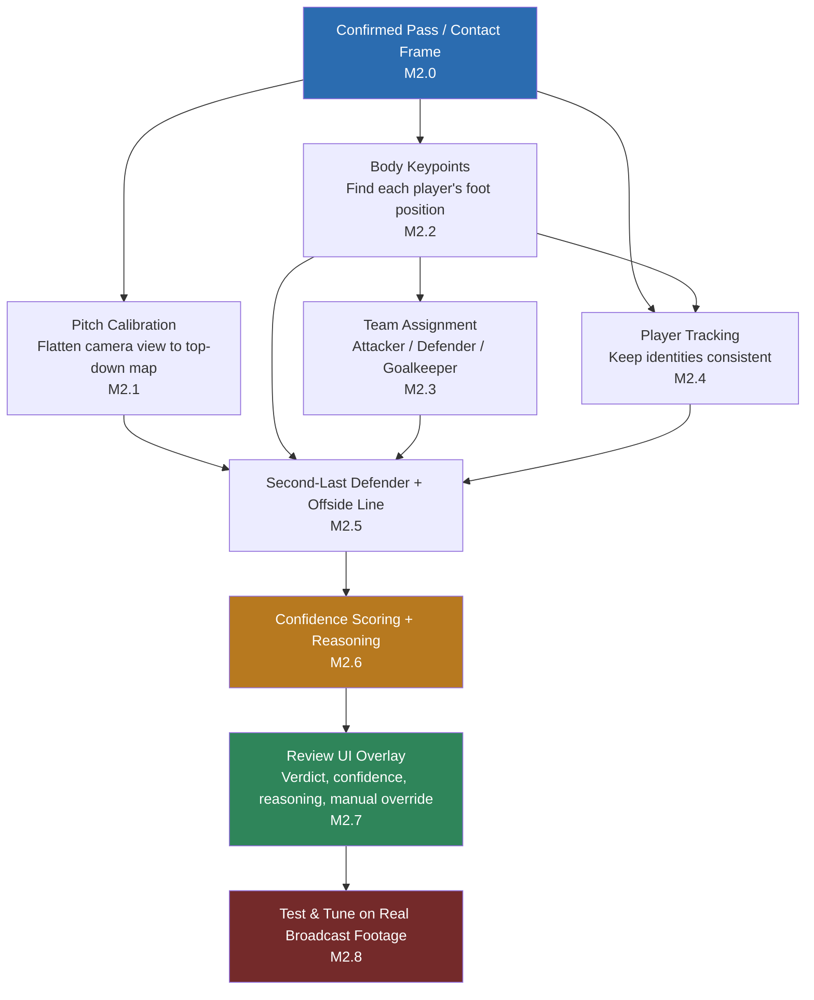

# Milestone 2 (M2) — Offside Detection Implementation Plan

## Application name: **RefEye** (be consistent everywhere)

## 1. What is this milestone, in plain words

Milestone 1 built the "find the right moment" tool: press a hotkey, the app looks at the last few seconds, and shows the operator the exact frame where a player passed, shot, or crossed the ball.

Milestone 2 adds a new brain on top of that: once the operator has picked the pass, **the app tries to figure out on its own whether that pass was offside**, and shows *why* it thinks so — not just a yes/no.

Important ground rule the client gave us: **the app does not need to be perfect**. A rough-but-honest answer is acceptable, as long as it always:
1. Points at roughly the right moment/players, and
2. Clearly says what it was confident about and what it couldn't check (bad angle, players too close together, camera too zoomed out, etc.), so the human operator can make the final call.

This means we are **not** building broadcast-grade VAR. We are building a **decision-support assistant that shows its own reasoning**, the same way a junior assistant referee might say "I think it's close, here's what I saw, you decide."

## 2. The rule we're teaching the computer (offside, explained simply)

Offside is judged at **one single freeze-frame**: the instant a teammate touches the ball to pass/shoot it forward. At that exact instant, look at the attacking player who's about to receive the ball:

- Are they standing in the opponent's half of the pitch?
- Are they standing **closer to the opponent's goal line** than *both* (a) the ball, and (b) the **second-last opponent player** (normally the last defender, since the goalkeeper is usually the actual last one — but not always)?

If both are true → offside. If the attacker is level with or behind that defender, or behind the ball, or in their own half → not offside.

Everything in this plan exists to answer one question as reliably as we can: *"at the contact frame, where exactly is everyone standing, relative to each other and the goal line?"*

## 3. Why this is harder than Milestone 1

Milestone 1 only had to find *when* something happened. Milestone 2 has to find *exactly where, in real pitch space,* several different people were standing at that instant — using a camera that isn't looking straight down at the pitch, cuts angles, zooms, and sometimes hides players behind each other. That "where" question is answered by chaining several separate AI/CV steps together, each one imperfect on its own, which is why this is treated as its own R&D phase rather than a quick add-on.

## 4. Reference Test Footage & Generalization Requirement

**Current development/testing is done against one client-provided clip:** `data/videos/client_m2_test_video.mp4` (1280x720, H.264, 30fps, ~13.8s). This is **not a live broadcast feed** — M2 work right now happens against this one recorded file, playing it back like any other local video source (same `LocalFileInput` path M1 already uses).

**This is a development/reference clip only — it must not become the design target.** Every model and threshold chosen in this plan (pitch-keypoint detector, pose model, team-color clustering, refinement weights, etc.) must be built to generalize across broadcast footage in general — different stadiums, camera rigs, kit colors, lighting, broadcaster graphics overlays — not tuned to look good specifically on this one clip. A pipeline that only works on `client_m2_test_video.mp4` and breaks on any other match footage would make the tool useless to the client, since the whole point is analyzing footage the client hasn't necessarily pre-selected or cleaned up. Concretely:

- Do not hardcode this file's resolution, camera angle, kit colors, or pitch-line visibility into any module — everything tunable stays in `config/`, per the existing cross-cutting rule (section 6 below).
- Treat this clip as the first entry in what should become a small evaluation set (see M2.8) — more real clips, ideally from different matches/broadcasts, should be added before any accuracy claims are made.
- When a phase's difficulty rating says "unpredictable on real broadcast footage" (M2.1, M2.8), assume this single reference clip is not sufficient evidence that the phase works — it only proves the code runs, not that it generalizes.

## 5. Scope Boundaries for M2

**In scope:**
- Making Milestone 1's "moment of contact" detection trustworthy (real model, not the placeholder heuristic it currently falls back to).
- Turning the camera's angled view of the pitch into a flat, top-down map (pitch calibration).
- Finding each player's precise foot position, not just a bounding box (pose estimation).
- Working out who is attacking, who is defending, and who is the goalkeeper.
- Keeping track of "who is who" across the clip so the right player is measured.
- Computing the offside line and the decision (offside / not offside / inconclusive).
- A confidence score and a plain-language reasoning trail for every decision.
- Wiring the result into the existing review UI (the panel built in M1) as an overlay + explanation, with manual override always available to the operator.

**Explicitly out of scope for M2:**
- Multi-camera 3D reconstruction (professional VAR hardware setup) — we use the single broadcast camera feed only.
- Automatic re-calibration mid-broadcast without any operator correction option — a manual "fix the pitch lines" fallback is allowed if auto-calibration fails.
- Rule exceptions that require football judgment, not geometry (interfering with play, active/passive involvement, deliberate play by a defender). The tool flags the geometric offside/onside call only; the operator applies these judgment exceptions.
- Full accuracy benchmarking / certification against real VAR footage — that would be a follow-on validation milestone once this pipeline exists.

## 6. Phase Breakdown

Each phase lists: what it does (plain words), what it touches (for the coding agent), difficulty, and what it depends on.

### Phase M2.0 — Make the "moment of contact" real, not a placeholder

**STATUS: ALREADY IMPLEMENTED — verified 2026-09-05.** Read this before touching this phase again.

**Plain words:** Everything in this milestone is measured relative to the exact pass frame. This phase was originally written assuming the app was still quietly falling back to a rough guess (a "kinematic heuristic") because the real model's files were never installed. That assumption turned out to be stale — the real checkpoint is already installed and wired in, and it loads and runs correctly.

**What was verified, concretely:**
- `models/tdeed/checkpoint_best.pt` (real SoccerNetBall_challenge1 weights, ~49.5MB) is present on disk.
- `config/default.yaml` already has `ai.action_spotter.provider: "tdeed"` (not `kinematic`) and `ai.detector.provider: "yolo"` (not `fixture`).
- Loading `ai/model_registry/registry.py`'s `ModelRegistry` with real settings produces `status = ModelStatus.READY`, `warnings = []` — no degradation, no fallback to the kinematic spotter or the synthetic fixture detector. Both YOLO detector and T-DEED spotter loaded and warmed up successfully on CUDA.
- `tests/integration/test_tdeed_adapter.py` — all 7 tests pass, including strict (`strict=True`) checkpoint loading (proves the vendored architecture genuinely matches the weights) and correct frame-alignment on padded sliding windows.

**⚠️ Important gotcha for any agent picking this up on a fresh clone/machine:** the checkpoint files (`models/tdeed/checkpoint_best.pt`, `models/detector/yolo11n.pt`) are **gitignored** (`.gitignore` line 13: `models/**/*.pt`) — they exist locally but are **not committed to git**. `git status` will never show them. If the registry falls back to `kinematic`/`fixture` on a different machine or a fresh checkout, the first thing to check is whether these weight files are actually present locally, not whether the integration code is broken — the code is confirmed working. These files need to be distributed separately (release asset, shared drive, etc.) when handing off or setting up a new environment.

**Touches:** `ai/action_spotting/tdeed/adapter.py`, model asset manifest (`deployment/model_assets`), `ai/contact_refinement/refiner.py` tuning.

**Difficulty:** Medium — the integration code already exists from M1, this is mostly about installing/validating real model weights and re-tuning refinement, not building new architecture. **(Now done — remaining work under this phase is limited to refinement tuning against real client footage, which is really an M2.8 concern.)**

**Depends on:** Nothing (this is finishing M1 work). Everything else in M2 depends on this, since a wrong contact frame makes every later step measure the wrong moment.

---

### Phase M2.1 — Flatten the camera view into a top-down pitch map (pitch calibration)

**STATUS: IMPLEMENTED (manual path reliable, automatic path partial) — 2026-09-05.** Read this whole entry before extending it; it records what was tried and failed.

**Plain words:** The camera looks at the pitch from an angle, like looking at a table from across the room. We can't measure "who's closer to the goal line" from that angled view directly — we first need to mathematically flatten it into a map, like looking straight down from above, using the pitch's own painted lines (touchlines, penalty box, center circle) as reference points.

**What was built:**

- `offside/field_geometry/pitch.py` — the pitch as a fixed reference: dimensions from config (105×68 default), ~30 named landmarks in metres, and the painted lines for drawing a top-down map. Penalty area / goal area / centre circle are fixed by the Laws and derived in code, deliberately *not* config, so a typo can't silently distort every calibration.
- `offside/pitch_calibration/homography.py` — the maths: solve image↔pitch from point correspondences, project both ways, reprojection error, and the goal-line **vanishing point**.
- `offside/pitch_calibration/line_detection.py` — classical detection of painted markings, plus vanishing-point estimation by consensus.
- `offside/pitch_calibration/calibrator.py` — the orchestrator, reporting a **capability level** rather than a pass/fail.
- Config under `offside.pitch_calibration`; tests: 23 unit (synthetic camera, exact answers) + 7 real-footage integration. All pass.

**⚠️ The key concept — three capability levels, not "calibrated / not calibrated":**

| level | means | comes from |
|---|---|---|
| `NONE` | nothing usable — say so, don't guess | too few markings |
| `DIRECTIONAL` | the goal-line vanishing point is known, so an **offside line can be drawn through any player** — but nobody's position in metres is known, and "is the attacker in their own half?" can't be answered | automatic |
| `METRIC` | full homography: metres, top-down map, half checks | **operator marks 4+ landmarks** |

`DIRECTIONAL` is worth the extra concept because it is *most of offside*: the judgement is "is this attacker beyond that defender along the goal-line direction", and a vanishing point answers that without a metric map. It also needs far less evidence — two parallel markings anywhere in frame, versus four identified landmarks.

**⚠️ What does NOT work automatically (do not re-attempt expecting different results):**

1. **"Lines parallel to the goal line look steep."** True for a halfway-line camera; **false on the reference clip**, where the camera sits off to one side and the penalty-area front line reads as a shallow diagonal. Absolute image angle carries no reliable pitch semantics. Line families are therefore grouped by what they *converge on*, not by how they look.
2. **Brightness alone finds pitch lines.** It finds advertising boards and white shirts far more strongly. Three filters were needed, each removing a measured impostor: grass containment (**eroded**, not dilated — dilation swallows the hoardings directly above the touchline), a **top-hat** filter keeping only thin bright structures, and **player-box exclusion** (a white shirt is a thin bright object on green — before this filter, *every* "steep line" found was a player).
3. **Don't erode the line mask.** Paint is 1-3px wide at this framing; a 3×3 opening deleted most of it and cut a frame from ~43 usable segments to 4.

**So: identifying *which* line is the 16.5m line vs the six-yard line is unsolved here**, and that's the gap between DIRECTIONAL and METRIC. The automatic path caps its confidence at 0.4 and emits an explicit warning that the goal-line group is an assumption. **The operator confirming the group (one dropdown click in the debug UI) or marking 4 landmarks is the reliable route today.** The upgrade that would make this automatic and metric is a learned pitch-keypoint model (SoccerNet-style calibration dataset/baselines) — it drops in behind the same `PitchCalibrator` interface without touching anything downstream.

**⚠️ Marks used to go silently wrong the moment the camera moved (fixed 2026-09-06).** Landmarks are marked in *image* coordinates. Left alone they stay pinned to the same pixels while a broadcast camera pans, tilts and zooms, and the pitch slides out from under them — every measurement built on that calibration is wrong from then on. **Nothing caught it:** four marked points always agree with each other perfectly, so the reprojection error sits at zero while the calibration describes a camera that stopped existing seconds ago. Measured on the reference clip, the marks were **349 pixels adrift after two seconds** of ordinary play.

`offside/pitch_calibration/tracking.py` (`CalibrationFollower`) fixes it by following the camera and carrying the marks with it:

- **The camera's motion is recovered from the whole frame, not the pitch.** A broadcast main camera rotates and zooms but does not travel, so under pure rotation *every* static point — pitch, stands, hoardings — moves between frames by one shared homography, whatever its distance. Features are therefore taken from anywhere except the players, who move by themselves and would otherwise drag the estimate with them.
- **Confidence is a ratchet.** Drift is cumulative and cannot be seen in the marks, so trust is derived from registration quality and from how far the marks have been carried since a human placed them — and it can fall but never recover. A run of clean frames after one poor registration is not evidence that the error it injected went away; only re-marking resets it.
- **Losing the camera drops the marks.** Rather than keep transforming points by a matrix it no longer believes, the follower discards them and says so in words: *"lost track of the camera — mark the pitch again on this frame"*.
- **A camera cut clears the marks**, using M2.4's cut detection. Identity now runs *before* calibration in the pipeline for exactly this reason: a cut ends the validity of the operator's pitch marks as surely as it ends a player's identity.
- **The default flow window had to be widened** (31px, 4 pyramid levels): with the library defaults, registration failed on a fast pan — precisely when the camera is moving most and the correction matters most.

Measured on the reference clip: inlier ratio stays at 0.99-1.00 through 60 frames of real play, the marks follow ~350px of pan, and confidence decays to ~0.53 over two seconds, which is the honest "re-mark before trusting distances" signal rather than a failure. Tests: 11 unit (known synthetic transforms) + 5 real-footage.

**Automating the marking entirely (not built).** A learned pitch-keypoint model — SoccerNet's camera-calibration track and its baselines — outputs exactly what the operator's clicks output, so it drops in as a third source of correspondences behind this same interface, with `solve_homography`'s reprojection error as the automatic check on its output and the operator as the fallback when it fails. Two things to settle first: several good pretrained checkpoints are trained on research-licensed data (fine for this MVP, a question at commercial delivery), and it needs validating on more than one clip (M2.8).

**⚠️ The marking UI was unusable until the map became the instruction (fixed 2026-09-06).** The operator was asked to pick a landmark from a dropdown of 29 names — `centre_mark`, `left_penalty_area_top_corner` — and click it in the video. Nobody can do that: the names mean nothing without a picture of a pitch, and the top-down panel just said "metric calibration required", which is a complaint rather than a hint. The panel now **is** the instruction: it draws every landmark on a pitch diagram, rings the one being asked for, shows already-marked ones in green with their names, counts progress ("2 of 4 marked"), and can be clicked directly to choose the next point. After each mark the selection advances to an unmarked landmark, so the obvious next click does not silently re-mark the same point. The drawing and the click hit-test share one transform (`top_down_transform`), because two copies of that arithmetic would drift and the map would quietly stop selecting what it displays.

**Touches:** New modules `offside/pitch_calibration/`, `offside/field_geometry/`; `core/config/schema.py`, `config/default.yaml`; `tools/pipeline_debugger/` (the marking UI above).

**Difficulty:** Hard — broadcast cameras cut angles and zoom constantly, so this can't be calibrated once per video; it may need to be re-done whenever the shot changes, and pitch lines can be partly hidden by players or shadow. **(Confirmed: the geometry and the manual path are solid; automatic landmark *identification* is the part that remains hard and is honestly reported as such rather than guessed.)**

**Depends on:** Nothing directly (it works off any frame near the contact moment), but its *output* is required by every geometry step later (M2.4, M2.5, M2.6). Can be built in parallel with M2.2/M2.3.

**Note for M2.5:** consume `PitchCalibration.offside_line_through(point)` — it works at both METRIC and DIRECTIONAL level and returns `None` when the frame can't support a line, so the "inconclusive" path is already wired. Check `is_metric` before asking for metres.

---

### Phase M2.2 — Find each player's exact foot position, not just a rough box

**STATUS: IMPLEMENTED — 2026-09-05.** Read this before extending it.

**Plain words:** A normal player-detector draws a rectangle around a whole player. But offside is decided by *feet* (the body part closest to the goal line), and a player's foot can be far from the center of that rectangle — think of a player mid-stride with their leg stretched out. We need a smarter model that finds actual body points (head, shoulders, hips, feet), not just a box.

**What was built:**

- `offside/body_keypoints/keypoints.py` — COCO-17 keypoint vocabulary and the data types (`PlayerPose`, `Keypoint`, `GroundPoint`, `LeadingPoint`). This is also where the Law 11 rule that **arms and hands are not valid offside surfaces** is encoded once (`OFFSIDE_SURFACE_KEYPOINTS`), so no later phase can accidentally draw a line off a reaching player's wrist.
- `offside/body_keypoints/ground_point.py` — pure, model-free policy. Two outputs, and they are not the same point:
  - **ground point** — where the player meets the pitch. With two visible ankles the *lower* one wins (the planted foot; the raised foot is off the pitch plane and would project a stride too far forward). Fallback ladder: ankle → knee-projected → box-bottom, each with a lower confidence and a plain-language reason.
  - **leading point** (`leading_offside_point`) — the most advanced *legal* body part along a direction. M2.5 supplies the direction once the pitch is calibrated; this module only knows which parts are legal to measure.
- `offside/body_keypoints/estimator.py` — `YoloPoseEstimator`, behind the new `PoseEstimator` protocol in `core/interfaces/vision.py`.
- Config under `offside.body_keypoints` in `config/default.yaml` (schema: `core/config/schema.py`); wired into `ModelRegistry` with an accessor `get_pose_estimator()`.
- Tests: `tests/unit/test_body_keypoints.py` (16, pure policy) and `tests/integration/test_pose_estimator.py` (11, real model on the real client clip). All pass. Verified end-to-end: registry loads `status = READY`, pose model on CUDA, warmup ~80ms.

**⚠️ Key finding — pose must run on crops, not whole frames.** Measured on the reference clip (players ~90-100px tall):

| approach | players found |
|---|---|
| whole frame, `imgsz` 1280 | **1-2 of ~17** |
| per-player crops, `imgsz` 256 | **11-13 of ~17**, most with a confident ankle |

Wide broadcast framing leaves too few pixels per player for whole-frame pose estimation. So this is a **top-down** estimator: the detector says who is a player, each box is cropped, padded and upscaled, and posed individually. Do not "simplify" this back to a whole-frame call — it looks cleaner and finds almost nobody. A bigger pose model does not fix it either; the shortage is pixels, not capacity.

**⚠️ Second finding — the detector needs `imgsz: 1280` for this footage.** At the M1 default of 640 the detector finds almost no players in a wide broadcast shot; at 1280 it finds 16-18. M1's live-preview config was deliberately left alone (it is tuned for cheap continuous detection), but **the offside path must run detection at the higher resolution** or every phase downstream starves. M2.5/M2.8 need to decide where that setting lives — probably a separate triggered-analysis detector config rather than raising the live one.

**Design rules baked in (don't undo them):**
- **One `PlayerPose` per person detection, always** — including players whose pose failed, which carry a box-bottom ground point plus a warning. Silently dropping them would corrupt M2.5's second-last-defender ranking, since the hardest player to pose (occluded, distant) is exactly the one whose absence moves the offside line.
- **Neighbour guard** — padding a crop drags in adjacent players, so a pose is accepted only if its own box overlaps the detection it was cropped for (`match_iou`). A silently swapped skeleton is worse than a missing one.
- **Identity stays with the detector/tracker** — the pose model never creates, removes or renames a player.
- Confidence is comparable across the whole fallback ladder (a guess can never outrank a measurement), because M2.6 uses it to decide whether a call is safe to make.

**⚠️ Gitignore gotcha (same as M2.0):** `models/pose/yolo11n-pose.pt` is **not in git** (`models/**/*.pt`). If offside body points show as unavailable on another machine, check the file exists before debugging code — see `models/pose/README.md` for the one-line download. Missing weights degrade gracefully: M1 keeps working entirely, and the status line says offside body points are unavailable.

**Touches:** New module `offside/body_keypoints/`; `core/interfaces/vision.py` (`PoseEstimator` protocol), `core/config/schema.py`, `config/default.yaml`, `ai/model_registry/registry.py`, `pyproject.toml` + `deployment/packaging/RefEye.spec` (new package must be packaged).

**Difficulty:** Medium-Hard — off-the-shelf pose models exist and are well-proven, but broadcast footage (motion blur, small distant players, players overlapping) makes foot-point accuracy noisy, which is exactly the kind of "low confidence but flag it" case the plan accounts for. **(Confirmed in practice: ~60-70% of players get a measured ankle on the reference clip; the rest fall back honestly. That residual is a tuning target for M2.8, not a blocker for M2.1/M2.3.)**

**Depends on:** Real player detection being active (already true — `ai.detector.provider` is `yolo`). Independent of M2.1, can be built in parallel.

---

### Phase M2.3 — Work out who's attacking, who's defending, and who's the goalkeeper

**STATUS: IMPLEMENTED, then rebuilt for accuracy — 2026-09-06.** Read this whole entry before extending it; the second pass changed the architecture, not just the thresholds.

**What was built:**

- `offside/team_assignment/teams.py` — the vocabulary. Two **anonymous** colour groups (`team_a` / `team_b`) plus `attacking_team_id`, deliberately kept as separate ideas; roles are `OUTFIELD` / `GOALKEEPER` / `UNKNOWN` only.
- `offside/team_assignment/illumination.py` — **the pitch used as a grey card.** Whatever the grass measures as in a frame *is* the illuminant; mapping it back to a canonical green takes the lighting out of every shirt. Sampled from the grass *beside each player*, so a half-shadowed pitch stops splitting one team into two colour groups.
- `offside/team_assignment/jersey_color.py` — the feature: the **two dominant colours** of the torso quad defined by M2.2's shoulder and hip keypoints, in CIELAB, with grass and skin masked out. Behind a `TeamFeatureExtractor` protocol.
- `offside/team_assignment/tracks.py` — short-lived player identities, so a team is decided **once per player, not once per frame**.
- `offside/team_assignment/clustering.py` — deterministic weighted two-means with iterative outlier trimming, written out rather than importing scikit-learn into a PyInstaller build.
- `offside/team_assignment/assigner.py` — the orchestrator, plus `TeamOverrides` (the operator's corrections, as data).
- Config under `offside.team_assignment`; a stage card, kit-coloured boxes and a dashed "needs confirming" outline in the pipeline debugger; tests: 35 unit + 10 real-footage integration. All pass. **No new model weights** — this stage is pure CV, so nothing extra to distribute.

**⚠️ No kit colour is stored anywhere, and none ever should be.** The two kits are discovered from the footage on every run. A configured "home team is red" would be worthless on the next match, which is the whole point of section 4. There is no LLM in this path either: a language model cannot produce the *calibrated* confidence number M2.6 needs, and colour clustering can.

**⚠️ The design target is "right or silent", not "usually right".** Full automation, with confirmation only when unsure. Every player carries `needs_confirmation`, and the thresholds behind it (`vote_share_to_confirm`, `confident_player_confidence`, `min_frames_to_trust`) are set so that a player who is **not** flagged is one the pipeline is prepared to be judged on. Residual error is meant to reach the operator as a question, never as a confident wrong answer. Raising those thresholds trades more questions for fewer mistakes; that trade is the accuracy dial, and it lives in config.

**⚠️ Four things that are not colour questions, handled separately:**

1. **A player's team belongs to the person, not the frame.** Measurements are pooled against an identity and every frame votes, so a blurred or half-occluded frame becomes a losing minority vote instead of a wrong answer. **Measured: team changes between consecutive frames fell to 1 in 465 (0.2%).** The tracker here is box-overlap only and steps aside the moment a pose carries a real `track_id` — M2.4 upgrades this stage's accuracy without touching a line of team logic.
2. **Which side is attacking.** Clustering yields "these look alike"; attacking is a fact about the *moment*. `passer_xy` — the operator-confirmed player who played the ball at the contact frame — decides it outright when supplied, since the operator is already looking at that exact frame in the review panel. Ball proximity is the automatic fallback; with neither, sides stay unknown and confidence is capped at 0.35.
3. **Who is the goalkeeper.** "Wears something different" also describes the referee and a substitute. What identifies the keeper is *position*: alone, behind everybody, at one end. Outliers are ranked along the goal-to-goal axis — metres at METRIC calibration, an ordering at DIRECTIONAL, **nothing at all uncalibrated**, in which case the stage says it cannot tell.
4. **Whether that matters.** Mostly it does not: Law 11 counts the second-last **opponent**, whoever that is, so `opponents()` includes the keeper and a missing keeper label degrades the *explanation*, not the geometry.

**⚠️ Three failures real footage found. Do not undo these fixes:**

1. **A lone odd kit took a whole team slot.** Plain two-means gave the single player in red one of the two slots and lumped white and maroon into the other. **No distance-based outlier test can catch this** — a group of one sits exactly on its own centre, so its residual is zero. Fix: a group smaller than `min_cluster_fraction` of the frame is an outlier group *by size*, dropped, and the fit repeated.
2. **A single average colour is meaningless for half of real kits.** Stripes and hoops average to a blend that matches neither colour and shifts as the player turns; a red-and-blue kit can average to exactly a solid purple one. Fix: two colours per player, ordered by lightness. A solid kit produces two near-identical colours and behaves as before.
3. **The pattern test then found creases.** A brightness-based version called **11 of 20 players striped in a match between two solid kits**. Fix: a second colour must differ clearly in *hue* — or differ far more in brightness than a fold ever does, which is what keeps black-and-white stripes distinguishable. **Measured: false "patterned" rate 51% → 6%.**

**⚠️ Down-weighting lightness looks obviously right and measured worse.** It is what a shadow moves most, so the instinct is to discount it — but on the reference clip it dropped kit separation from 58 to 43 and the separation-to-spread ratio from 2.9 to 2.3, because white and maroon differ mostly in *how bright they are* (as does any black-vs-white match). Lighting is therefore fixed at the source (grass reference) rather than by blunting the feature. `lightness_weight` stays configurable so a clip with a hard sun/shade split can be tested against it in M2.8; it defaults to 1.0 on the evidence.

**Measured on the reference clip** (white vs maroon kits, ~16-19 players detected, 40 consecutive frames): 0.2% team changes between frames; 6% false pattern rate; kit separation ~55 colour units against a within-kit spread of ~19; roughly 11 players settled and 8 awaiting confirmation per frame, the latter dominated by players whose shirt could not be measured at all. Overall stage confidence sits at 0.35 on these frames because no ball is detected on them — the honest cap, not a bug.

**Manual override** lives in `TeamOverrides` as a data-layer object, not a UI concern, so the debugger, the M2.7 review panel and the tests all drive the same path: `pin_player`, `swap_teams` and `set_attacking_team`. An overridden player is marked `operator`, confidence 1.0, and never asked about again.

**Touches:** New module `offside/team_assignment/`; `core/config/schema.py`, `config/default.yaml`, `tools/pipeline_debugger/`.

**Difficulty:** Medium — clustering by shirt color is a well-understood technique, but kits that look similar, players in shadow, or unusual goalkeeper kits can confuse it, so a manual override is required rather than trusting it blindly. **(Confirmed. The clustering was the easy half; the accuracy came from deciding per player instead of per frame, removing the lighting, and refusing to over-claim.)**

**Depends on:** M2.2 (needs player positions/crops to classify their shirts from).

**Next levers if M2.8 shows this is still not enough**, in order of value: (a) real identities from M2.4, which strictly improves the pooling; (b) restricting classification to the handful of players who can affect the line at the contact frame, turning 19 chances to be wrong into 5; (c) a crop-embedding extractor (OSNet/CLIP) behind the same `TeamFeatureExtractor` protocol, for matches where colour genuinely cannot separate the kits (two whites, two darks).

**Note for M2.5:** consume `TeamAssignment.opponents()` (defending side, keeper included) and check `sides_are_known` first — it is `False` whenever no ball anchored the attacking side, which is the "inconclusive" path, already wired.

---

### Phase M2.4 — Keep track of "who is who" through the clip

**STATUS: IMPLEMENTED — 2026-09-06.** Read this before extending it.

**Plain words:** The system needs to follow the same player across several frames so it doesn't accidentally swap two players' identities right at the critical moment (e.g. mixing up which one is actually the last defender).

**Why this phase is worth real effort:** the failure it prevents is *silent*. If two players swap identities before the pass, every later stage still runs perfectly and draws the offside line through the wrong person. Nothing downstream can detect it, because nothing downstream knows the swap happened.

**What was built:**

- `offside/player_identity/identity.py` — the vocabulary: `PlayerIdentity`, `IdentityResult`, and four states — `CONFIRMED` / `TENTATIVE` / `RECOVERED` / `CONTESTED`. Only `CONFIRMED` is trusted without a human look.
- `offside/player_identity/tracker.py` — `IdentityTracker`: overlap association with an **appearance gate**, re-identification after occlusion, camera-cut handling, and per-player confidence.
- Config under `offside.player_identity`; a stage card, identity trails and an overlay toggle in the Pipeline Inspector; tests: 15 unit + 6 real-footage integration. **No new model weights.**

**⚠️ This is deliberately not M1's `ByteTracker`, and M1's tracker is untouched.** Three things offside needs cannot be expressed through the M1 protocol, which returns a track id or nothing: an appearance gate, re-identification from a lost gallery, and the third answer — *"this association was ambiguous, do not build a verdict on it"*. The geometry (`iou`, `center_of`) is imported from the M1 tracker rather than duplicated; only the association loop is new.

**⚠️ Kit colour cannot separate teammates — and that is enough.** Two players on the same team are dressed identically by design, so appearance can never tell them apart. That sounds fatal and is nearly the opposite: the offside line is decided by *positions*, so swapping two players on the same team moves nobody and changes no verdict. The swap that breaks an offside call is attacker-for-defender — a swap between two different kits, which is exactly the case appearance catches.

**⚠️ Identities die at every camera cut.** Nothing about the previous shot constrains the next one — different part of the pitch, different players, possibly a replay of play already seen. Track ids therefore carry their segment (`s3t12`), so an id from before a cut can never silently come to mean somebody else afterwards. Kit colours deliberately *survive* the cut (`TeamAssigner.reset_identities`): it is the same match, and discarding the colour model would throw away good evidence and let the team labels flip between shots.

**⚠️ Two failures real footage found. Do not undo these fixes:**

1. **A one-frame detection drop is not a re-identification.** Broadcast detection loses a distant or half-occluded player for a frame constantly; the track coasts one step and re-matches with high overlap and the same kit. Treating every gap as a recovery left **11 of 18 players permanently flagged**, which would have made M2.5 refuse to use most of the pitch. Gaps up to `recovery_gap_frames` are now ordinary tracking (still penalised in confidence); only longer gaps and gallery re-identifications are `RECOVERED`.
2. **Lingering doubt was being reported with the wrong reason.** Doubt has to outlive the frame that caused it — a swap does not announce itself later — but doubt from a *crowded association* was being displayed as "came back after being hidden". In a tool whose entire purpose is trust, a wrong explanation is worse than a vague one, so the two kinds of doubt are now counted separately and reported as what they are. The ambiguity test was also tightened to look in **both** directions: another track wanting this player is not evidence on its own, because in a crowded box that is true of half the frame — it only counts when that rival has no clearly better match of its own.

**Measured on the reference clip** (40 consecutive frames, up to 23 players): 15 confirmed, 3 recovered, 2 contested, 1 tentative on the final frame — stage confidence 0.71, up from 0.39 before the two fixes above. 50 distinct identities minted across 40 frames for a scene holding ~20 players at once, the churn coming from players entering and leaving frame at the edges.

**It measurably improved M2.3, exactly as that phase predicted.** Team assignment pools its colour votes against these ids, and with real identities replacing the box-overlap stand-in, **team changes between consecutive frames went from 1 in 465 to 0 in 454**.

**Touches:** New module `offside/player_identity/`; `core/config/schema.py`, `config/default.yaml`, `offside/team_assignment/assigner.py` (`reset_identities`), `tools/pipeline_debugger/`. Reuses `vision/tracking/iou_tracker.py` geometry and `vision/scene_analysis/scene_cut.py` unchanged.

**Difficulty:** Medium — the base tracker already exists from M1; the new work is making it robust enough specifically around the contact moment, where a wrong swap directly breaks the offside call. **(Confirmed. The association was straightforward; the work was in deciding what deserves to be called doubt, and in not over-flagging so badly that the next phase can use nothing.)**

**Depends on:** M2.0 (needs the real contact frame to know which moment matters most) and M2.2 (needs player detections to track).

**Note for M2.5:** check `PlayerIdentity.is_trusted` before letting a player decide the line, and surface `IdentityResult.contested()` in the reasoning — a contested identity at the contact frame is exactly the "inconclusive" case the plan requires rather than a guess.

---

### Phase M2.5 — Find the second-last defender and compute the offside line

**STATUS: IMPLEMENTED — 2026-09-06.** Read this before extending it.

**Plain words:** Once we know the flattened pitch map, everyone's foot positions, and who's on which team, this step does the actual geometry: find the second-last defender, draw the line through them parallel to the goal line, and check whether the attacker and the ball are in front of or behind it.

**What was built:**

- `offside/offside_line/axis.py` — where players are along the goal-to-goal axis, and **which end is being defended**, which is not geometry at all and gets its own confidence.
- `offside/second_last_defender/ranking.py` — every opponent ranked, the second one taken.
- `offside/offside_line/line.py` — the line, the comparison, the uncertainty, and the verdict (`OFFSIDE` / `ONSIDE` / `TOO_CLOSE` / `INCONCLUSIVE`).
- Config under `offside.offside_line`; a stage card, the drawn line, the two measured points and the verdict in the Pipeline Inspector, plus an operator override for attack direction. Tests: 27 unit + 5 real-footage. **No new model weights.**

**⚠️ The central output is the uncertainty, not the margin.** The geometry is a comparison of two numbers along one axis; everything hard about this phase is inherited from the four before it. So the stage computes what the inputs could plausibly be wrong by, and compares:

    margin >  error  ->  offside position
    margin < -error  ->  onside
    otherwise        ->  too close to call, with the frame and the numbers

That last branch is the product, not a failure mode. A tool reporting "3cm offside" from a foot point measured to the nearest half-metre is lying; one that says "too close to call, here is the frame" is doing the job the client asked for. At METRIC the error is a fixed calibration cost plus a term per player scaled by how much M2.2 trusted each body point — counted twice, because two players are being measured. At DIRECTIONAL it scales with the player's own height on screen, which shrinks with distance exactly as the measurement error does.

**⚠️ Which end is being defended is not geometry, and reading it wrong inverts every verdict.** The identical picture read from the other end gives the opposite answer, so it is established from evidence and reported with its own confidence: the goalkeeper when they are genuinely the deepest player, otherwise the shape of the two teams, otherwise *unknown* — and the operator can state it outright, which outranks both. A keeper who has come for a cross is deliberately **not** used: they sit level with their own defensive line and prove nothing, and trusting them there would flip the call.

**⚠️ Both players are measured the same way, and arms never count.** Law 11 compares body parts nearer the opponents' goal line — the same physical direction for attacker and defender alike — so both come from M2.2's `leading_offside_point` along one axis, with arms excluded because a player cannot legally play the ball with them. A reaching attacker's wrist is frequently their furthest-forward point, and measuring it would call a legal attacker offside.

**⚠️ The goalkeeper is ranked like anybody else.** The Law counts the second-last **opponent**, not the last outfielder. A keeper off their line is not the last opponent, and then the second-last is a defender who would otherwise have been third. This is why M2.3's goalkeeper identification affects the *explanation* and never the verdict.

**⚠️ The ball is part of the Law, and a geometry-only tool forgets it.** An attacker beyond the second-last opponent but level with or behind the ball is onside. Leaving that check out produces a steady stream of confident false positives.

**⚠️ A finding from the first real end-to-end run: the geometry can be perfect and the answer still worthless.** On a frame with the two teams mixed together, the stage produced *"offside by 14.62m"* at a confidence of **0.08** — because the attack direction was barely more than a guess, and nothing else in the chain noticed. A number that precise beside a confidence that low is exactly the confident-and-wrong output this milestone exists to prevent. Verdicts below `min_confidence_to_call` are now withheld, and the refusal **names its own weakest link** ("which end is being defended is barely established"), so the operator is told what to go and fix rather than handed a number to distrust.

**What is deliberately not decided here:** which attacker is *involved* in play. That is football judgement — interfering with play, deliberate play by a defender — and section 5 puts it out of scope. Every attacker in an offside *position* is reported, most advanced first, and the judgement stays with the operator.

**In the Inspector:** the line is drawn through the second-last defender in the verdict's colour, the two measured body points are marked, the margin is printed beside the attacker, and the headline sits across the bottom of the frame. That is the one overlay a verdict can actually be argued with — a written "offside by 12cm" is a claim, a line with the attacker's measured point in front of it is evidence.

**Touches:** New modules `offside/offside_line/`, `offside/second_last_defender/`; `core/config/schema.py`, `config/default.yaml`, `tools/pipeline_debugger/`.

**Difficulty:** Medium — the math itself is simple geometry once the inputs are correct; the difficulty is entirely inherited from earlier phases (calibration drift, foot-point noise, wrong team assignment), so this phase is where earlier errors become visible. **(Confirmed exactly. The geometry took an afternoon; deciding when *not* to publish it took the rest.)**

**Depends on:** M2.1 (pitch map), M2.2 (foot positions), M2.3 (team roles), M2.4 (correct player identities at the contact frame).

**Note for M2.6:** every input already carries its own confidence and `OffsideDecision` already aggregates the weakest link — M2.6's job is to turn that into the operator-facing explanation and to widen the reasoning across stages, not to re-derive the numbers.

---

### Phase M2.6 — Build the confidence score and the "here's my reasoning" explanation

**STATUS: IMPLEMENTED — 2026-09-06.** Read this before extending it.

**Plain words:** Instead of a flat yes/no, the app says *"Offside — high confidence, every stage behind this call is solid"* or *"No call — the geometry reads offside, but the pitch marks have been carried a long way from the frame they were placed on. Here is the frame; please judge it."* No new AI: every earlier phase already reports how much it trusts itself, and this combines those into one honest summary.

**What was built:**

- `offside/decision_support/signals.py` — one `ConfidenceSignal` per stage (M2.1–M2.5), each carrying the three things an operator can act on: how good it is, why it is that good, and what to do about it.
- `offside/decision_support/explainer.py` — the aggregation, the withholding rule, and the operator-facing sentence.
- `offside/decision_support/explanation.py` — `ConfidenceBand`, `DecisionExplanation`, and `operator_decision()`.
- Config under `offside.decision_support`; a stage card in the Pipeline Inspector. Tests: 39 unit. **No new model weights.**

**⚠️ Confidence is the weakest stage, never the average.** An average is how a tool ends up publishing a confident wrong answer: four solid stages outvote the one that failed, and the failed one is invariably the one that decided the verdict. A chain is exactly as strong as its worst link, so the worst link sets the number **and gets named** — the useful half of a low score is which stage to go and fix, not the score itself.

**⚠️ Withholding and abstaining are different outputs and must not be merged.** *Too close to call* is a measurement result: the margin is genuinely inside what the geometry can resolve, that is an honest answer, and it is published however weak the chain is — a weak chain cannot make an abstention wrong. *Withheld* means the geometry reached a verdict the chain cannot carry; the verdict is kept and shown as **what was withheld**, never as the call.

**⚠️ Why this exists when M2.5 already has a confidence floor.** M2.5's floor sees only its own inputs — the attack direction, the defender, the attacker. It never sees that the pitch marks drifted, that the two players being compared were mixed up a frame ago, or that the teams came from kit colours the stage itself wanted confirmed. Each of those produces a decision that looks entirely normal and is wrong.

**⚠️ Signals are about *this* decision, not the frame in general.** Eighteen players with clean foot points do not help when the second-last defender is the one box-bottom guess on the frame, and a frame-wide average would call that a good frame. Where a stage can be narrowed to the two players actually being compared, it is.

**⚠️ Absence of evidence is not evidence — measured on the reference clip.** The first build scored player tracking 0.00 on every frame right after a camera cut ("0 players are being followed reliably"), which vetoed every call for the opening stretch of every shot on the strength of nothing having happened yet. A tracker with no *contested* players has no rival claims; the risk this signal guards against — two players swapped — announces itself as contested, which still caps hard. A young tracker is now reported and left non-capping, and settles to ~0.84 within four frames on the clip.

**⚠️ A stage's description and its caveat are different sentences.** The first panel build printed *"limited by: pitch calibration: the pitch is marked, so positions are measured in metres"* — a true statement about a working stage, and nonsense under a heading that reads "limited by". Signals now carry a separate `concern` wording for when they are listed as a caveat.

**Touches:** New module `offside/decision_support/`; `core/config/schema.py`, `config/default.yaml`, `tools/pipeline_debugger/`.

**Difficulty:** Medium — no new modeling problem, and the arithmetic is one `min()`. The work is entirely in deciding what the tool is allowed to say, and in the wording. **(Confirmed. Every real bug in this phase was a sentence, not a number.)**

**Depends on:** M2.5 (needs the computed line to explain), and every phase before it for the signals.

---

### Phase M2.7 — Show it in the review screen

**STATUS: IMPLEMENTED — 2026-09-06, in two passes.** Read this before extending it.

**Plain words:** The operator picks a pass in the M1 review screen, confirms the contact frame the way M1 always worked, and that confirmation now *automatically* runs the whole M2 pipeline on it — a live checklist shows each of the seven stages finishing, and the result lands as the offside line drawn over the players, the verdict, the confidence, the plain-language reasoning, and every stage's own score, with a manual override always one click away.

**The first pass built a panel with nothing behind it — caught by the operator, not by testing.** The panel, the meter, the override buttons and 21 passing unit tests were built and reported as "M2.7 implemented." All of it was real, and all of it was inert: nothing in the shipped app ever called `OffsidePipeline`. The operator asked two plain questions — does the app actually run the pipeline, and is it automatic or manual — and the honest answer at the time was *neither*: only the standalone debugger and the test suite ever drove it. The lesson worth keeping: a UI component with full test coverage is not the same claim as "this is wired up," and a milestone report should say so explicitly rather than let the two blur together.

**What the second pass built, to close that gap:**

- `offside/pipeline.py` — `OffsidePipeline` itself, **moved out of `tools/pipeline_debugger/`** into the product tree (the debugger now re-exports it) — a shipped feature calling into `tools/` was the layout admitting the pipeline wasn't really shipped. `analyse()` gained an `on_stage` callback, firing after each of the seven stages so a live UI can show progress rather than waiting on the whole frame.
- `apps/desktop/viewmodels/offside_runner.py` — `OffsideRunner`, a plain daemon thread (matching the project's existing `_load_models` pattern, not the M1 request manager's state machine — see the module docstring for why the two must not be merged) that runs the pipeline on the confirmed frame and forwards `started` / `stage_progress` / `completed` / `failed` as Qt signals. Guards against a stale result landing after the operator has already confirmed a newer frame.
- `apps/desktop/ui/widgets/offside_progress.py` — `OffsideProgressPanel`, a seven-row checklist (one per pipeline stage, in pipeline order) that fills in live, so the several seconds of model inference reads as "detection done, pose next" rather than a spinner that names nothing.
- `MainWindow._on_confirmed` now also calls `MainViewModel.check_offside(frame_id, image)` — the trigger is automatic on confirm, with no extra button, exactly as scoped. Tests: 16 unit (`OffsideRunner`, `OffsideProgressPanel`) + 3 integration (`MainWindow` end to end: confirm to checklist to panel).

**⚠️ The caveats carry the same visual weight as the verdict.** "Offside — high confidence" alone is a verdict to be taken on trust; the same headline with *"limited by: the pitch marks were placed two seconds ago"* underneath is a decision the operator can weigh. They are shown beside calls the tool is perfectly willing to stand behind — an operator told only the good half has been handed a sales pitch. The converse is enforced too: a healthy chain invents no caveats, because a panel that always shows one teaches the operator to ignore them.

**⚠️ A stage's description and its caveat are different sentences.** The first build of the panel printed *"limited by: pitch calibration: the pitch is marked, so positions are measured in metres"* — a true statement about a healthy stage, and nonsense under a heading that says "limited by." `ConfidenceSignal` now carries a separate `concern` wording (M2.6) for exactly this case.

**⚠️ A `str` Enum can collide with a plain string as a dict key, silently.** The checklist's first build used the sentinel strings `"pending"` / `"running"` for a row that has not reported yet — and `StageState.PENDING` (a `str` Enum member) hashes and compares equal to the plain string `"pending"`, so `StageState.PENDING: "not built"` silently overwrote the row's own `"pending": "waiting"` entry in the same dict literal. A stage the panel had never heard from read as "not built" instead of "waiting." Caught by a test, fixed by renaming the sentinels to strings that cannot collide (`"row_pending"`, `"row_running"`).

**⚠️ Every stage is listed, including the ones that are fine.** A panel that shows only problems cannot be used to check that there are none. A stage with nothing to say about the frame shows `n/a`, never `0.00`, because zero reads as a stage that failed.

**⚠️ The override is a first-class output, not an escape hatch.** It travels the same `DecisionExplanation` path the pipeline's own answer does — one display, log and export route, not a second, less-tested one for the answer the operator actually signs. It also **does not erase what the tool said**: the tool's headline, its caveats and its per-stage scores stay on screen under the override, because whoever reviews the decision later needs to see what was overruled.

**⚠️ The panel and the picture must never disagree.** The line is drawn in the *published* verdict's colour, so a call M2.6 withheld appears in neutral grey rather than confident red, and an override repaints the line immediately. The overlay is drawn on a **copy** of the frame — the review buffer's image is shared with every other view, and drawing into it would burn a stale line onto the frame everywhere it appears.

**⚠️ A stale result must lose the race, not win it.** If the operator confirms frame 5 and then frame 9 before frame 5's analysis finishes, frame 5's result must never land afterwards and silently overwrite what the operator is now looking at — `OffsideRunner` tracks the most recently requested frame id and drops anything else that completes.

**⚠️ M2 is additive to M1.** A review screen that is never given an offside decision behaves exactly as it did in M1; there is a test for precisely that.

**Touches:** `offside/pipeline.py` (moved from `tools/pipeline_debugger/`), `apps/desktop/viewmodels/offside_runner.py` (new), `apps/desktop/ui/widgets/offside_progress.py` (new), `apps/desktop/ui/widgets/offside_review.py`, `candidate_review.py`, `screens/analyzer_screen.py`, `main_window.py`, `viewmodels/main_viewmodel.py`, `theme/stylesheet.py`, `offside/offside_line/rendering.py`.

**Difficulty:** Easy-Medium for the panel; the second pass (actually wiring it) turned out to be its own small milestone — a new runner, a new progress widget, and moving a 700-line module to a different package without breaking five files' worth of existing imports. **(Revised. "The UI patterns existed from M1" was true of the widgets and false of the wiring — those are not the same kind of work.)**

**Depends on:** M2.6 (needs a decision and an explanation to display).

**A third pass, from real use on `demo_video_offside_1.mp4` frame 122 — 2026-09-06.** Three things surfaced by actually confirming a frame in the wired-up app, not by any test:

- **A real accuracy bug in M2.3's attacking-side inference.** On a corner/rebound frame the ball's nearest detection had no kit colour measured (occlusion), and `_name_attacking_team` gave up entirely rather than trying the next-nearest player who *did* have one — throwing away a perfectly good signal one rank down. Fixed in `offside/team_assignment/assigner.py`: it now walks the sorted distance list for the nearest player *with* a team, not just the single nearest detection. (On that same frame, the real players near the ball were all fractionally past the 1.5-box-width threshold anyway — a second, separate finding, left for M2.8's tuning pass since it needs more than one data point to size correctly rather than a guess.)
- **The right rail broke at any normal window size, not just a small one.** Three different widgets each independently set a hard floor wider than the column: the checklist's longest stage title rendered at full length (556px), the "Last 20s" camera thumbnail inherited the *main* video panel's 320px minimum, and the operator-override buttons sat in one row of four. Each was invisible until the column was wrapped in a scroll area (`AnalyzerScreen._build_right_column`) — before that, the fixed-stretch layout just silently squeezed everything to fit, which looked like cramped padding rather than the hard minimum-width violation it actually was. Fixed: short checklist labels with the full title as a tooltip, an explicit small minimum on the thumbnail, and a 2x2 button grid. Regression tests assert a width budget on all three so a future addition trips a test rather than reintroducing this silently.
- **`QLabel.setPixmap()` is not a safe way to show a scaled-down render.** The pitch map's first build used one; `QLabel.sizeHint()` follows the *pixmap's* pixel size once set, so the very first render (before layout had assigned the widget a real width) locked in the map's native 760px render width as the label's preferred size. Rewritten as a custom-painted widget that fits its own pixmap to whatever rect it is actually given — the same technique `VideoSurface` (the main video panel) already used, correctly, the whole time.

**What was added:** `apps/desktop/ui/widgets/pitch_map.py` — `PitchMapPanel`, built into the Analyzer screen's right column. It draws with the exact same `render_top_down` the Pipeline Inspector uses (`offside/pitch_calibration/rendering.py`, moved out of the debug tool the same way `offside/pipeline.py` and `offside/offside_line/rendering.py` were), including whatever calibration marks the pipeline actually used. `render_top_down` gained one new parameter, `interactive` (default `True`, `False` from the review screen): the inspector's "click these 4 points" instruction assumes a click handler that only the debug tool has, and would be actively misleading on a screen with no way to click anything — the read-only caller gets a status line instead. Tests: 6 unit (rendering), 9 unit (panel), 3 integration (screen wiring) + 1 (`MainWindow` end to end), 1 unit (the team-assignment fix).

---

### Phase M2.8 — Test and tune against real broadcast footage

**Plain words:** Every phase above will behave differently on real match footage than on clean test clips — different stadiums, lighting, kit colors, camera styles. This phase is where we run the whole pipeline against real clips, see where it's wrong or unsure, and adjust.

**Touches:** All modules above; primarily config/threshold tuning (`config/`) plus targeted fixes per module, and a small labeled evaluation set of real clips with known correct offside calls for comparison.

**Difficulty:** Hard — real broadcast footage is unpredictable (motion blur, replays, compression, unusual angles), and because every phase feeds the next, errors can stack; this is where the actual reliability of the feature gets proven or found lacking.

**Depends on:** All previous phases (M2.0–M2.7) being functionally connected end-to-end first.

### The Pipeline Inspector — the operator sees every step (built alongside every phase)

**STATUS: BUILT — 2026-09-06.** Started life as a developer debug view; it is now a first-class deliverable in its own right.

```bash
make inspect                                   # opens the client reference clip
python -m tools.pipeline_debugger [clip.mp4]   # or any other clip
```

**Plain words:** load a video, step through it, and watch it pass through every stage of the pipeline with the working shown. Not a summary of what happened — the actual output of each stage, drawn on the actual frame.

**Why this is a requirement and not a nice-to-have.** An operator cannot be asked to accept an offside verdict from a system whose reasoning is invisible; a verdict with no visible working is just an assertion, and the client's stated requirement (section 1) is a tool that *shows what it was confident about and what it could not check*. The inspector is where that promise is kept. It also happens to be the fastest way to find bugs — three of the failures recorded in this plan were found by looking at this window.

**It is the product, not a mock-up of it.** It loads the same config and the same models through the same `ModelRegistry` and calls the same modules. If the inspector shows it, the product computes it.

**What is on screen:**

- **Source bar** — open any video (`Open video…`), plus model status. Loading a new clip clears the pitch marks, kit colours and player identities, because all of them describe footage that is gone.
- **Left: the frame**, with every overlay toggleable — player and ball boxes, body skeletons, foot positions (green measured / orange inferred / red guessed), the line-detection mask, detected markings coloured by which family they converge on, a goal-line-parallel line through every player, marked landmarks, and each player's box painted in the kit colour actually measured from them.
- **Pipeline tab** — every stage in this plan as a card: state badge (`OK` / `PARTIAL` / `UNAVAILABLE` / `NOT BUILT`), a one-line headline, the facts behind it, and its own warnings in amber.
- **Teams tab** — **two grids of kit swatches, one per team**, plus a third for everyone on neither. Each cell shows the player's own crop, the **two colours** measured from it (a solid kit shows two identical bars, a striped kit shows both stripe colours), the confidence, and a dashed border when the pipeline wants a human look. Selecting a cell rings that player on the frame. The correction bar applies *Confirm as shown*, *→ Team A/B*, *Goalkeeper*, *Not a player*, *Undo my change*; each column can confirm all its flagged players at once.
- **Pitch tab** — landmark marking, the goal-line group selector, the attacking-side override, and the top-down map with players projected onto it, filled by team colour with a ring showing how certain their foot position is.

**⚠️ Swatches are shown as filmed, not as measured.** The maths runs on a lighting-corrected colour (see `illumination.py`); the swatch on screen has that correction undone. A correct measurement that *displays* as the wrong colour beside the player's own crop reads as a bug, and costs exactly the trust this view exists to build.

**Design rules to preserve as phases land:**

- **Every stage in this plan appears, including unbuilt ones**, marked `NOT BUILT`. A missing phase must *look* missing rather than be absent from the page — a gap that is silently absent reads as "done".
- **Never show a conclusion without its evidence.** Every number sits next to the thing it was measured from. This is why the team view pairs each swatch with a crop rather than listing confidences.
- **Colour means the same thing everywhere: green = measured, orange = inferred, red = guessed.** A view that draws a box-bottom guess identically to a measured ankle hides the exact failure the operator is looking for.
- **What to display is decided in `presenter.py`, not in the widgets.** Selection and wording are part of the product, so they are plain data and are unit-tested without a display; `panels.py` only renders them. If a number is wrong on screen it is wrong in the presenter, and there is a test for it.
- **Adding a phase = implement its stage method in `tools/pipeline_debugger/pipeline.py`, move it out of `_report_pending_stages`, and add its panel.** A phase is not finished until the operator can see it work.

**Touches:** `tools/pipeline_debugger/` (`app.py` window, `panels.py` widgets, `presenter.py` view-models, `overlays.py` frame drawing, `pipeline.py` stage runner); `Makefile`. Tests: 15 presenter unit tests + 6 headless widget tests.

## 7. Cross-Cutting Rules for M2 (carried from M1 + architecture §60)

- Every stage must report its own confidence — no silent guessing.
- Never present a single hard "OFFSIDE"/"NOT OFFSIDE" without a confidence level and a reason string attached.
- When confidence is low, always fall back to showing the raw frame + line attempt so the operator can judge — never hide an inconclusive case as if it were a clean answer.
- Manual override available at every stage that involves classification (team assignment, calibration) — the operator can always correct the computer.
- Nothing tuning-related hard-coded — thresholds, calibration parameters, confidence weights all live in `config/`, same discipline as M1.
- No new module blocks the live-preview/UI thread — same non-negotiable rule as M1.
- **Every stage must be visible in the Pipeline Inspector before it counts as done** — a stage the operator cannot watch run is a stage they cannot trust, and this milestone's whole premise is decision *support*, not an oracle.
- New modules stay isolated behind clear interfaces (matching the `offside/` module boundary already reserved in the architecture doc), so any individual stage (e.g. the pose model) can be swapped later without breaking the rest.

## 8. M2 Definition of Done

- [x] Contact-frame detection runs on the real model, not the placeholder heuristic. *(M2.0)*
- [x] Given a confirmed pass frame, the app produces a flattened top-down pitch view. *(M2.1 — metric via operator marking; automatic reaches directional only)*
- [x] Each player's foot position is estimated, not just a bounding box. *(M2.2)*
- [x] Players are grouped into attacking team / defending team / goalkeeper, with manual override available. *(M2.3 — kits clustered per clip; attacking side from ball possession; keeper positional and only when the pitch is calibrated)*
- [x] Players are followed through the contact moment, with swaps prevented where kits differ and ambiguity reported rather than resolved. *(M2.4)*
- [x] The second-last defender is identified and the offside line is computed. *(M2.5)*
- [x] Every decision comes with a confidence level and a plain-language explanation of what was and wasn't verified. *(M2.6 — the weakest stage sets the confidence and is named; a verdict the chain cannot carry is withheld rather than published)*
- [x] Low-confidence/inconclusive cases show the frame and reasoning instead of forcing a guess. *(M2.5 — a margin inside the measurement error is reported as too close to call, and a verdict below the confidence floor is withheld with its weakest input named)*
- [x] Every stage of the pipeline can be watched running on any video, with its own evidence, in the Pipeline Inspector. *(built 2026-09-06; each new phase adds its panel)*
- [x] The review UI displays the pitch-line overlay, verdict, confidence, and reasoning, with manual override. *(M2.7 — caveats shown beside confident calls, every stage scored, and the tool's own reading kept visible under an override)*
- [ ] The full pipeline has been run against a set of real broadcast clips with known outcomes, and results/failure patterns are documented.

## 9. What Happens After M2 (not built now, just so scope stays honest)

If M2's accuracy proves promising, a follow-on milestone could focus on: expanding the real-footage evaluation set for a proper accuracy benchmark, handling rule exceptions that need football judgment (interfering with play, active/passive involvement), improving calibration robustness across more camera/broadcast styles, and packaging/performance hardening for live use. None of that is built now — M2 is scoped to prove the pipeline works end-to-end with honest confidence reporting, not to certify it.

## 10. Pipeline Diagram


