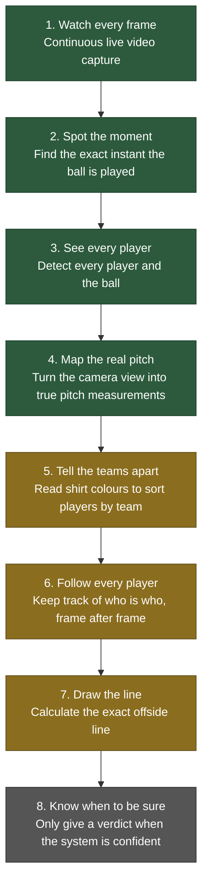

# Automatic Offside Detection: Our Progress So Far

## What we are building

The goal is simple to say and hard to build: an AI system that watches a football match and tells you, automatically, whether a player was offside, the same way a well trained assistant referee would, but working from video alone.

To do that properly, the system has to do several difficult things in order, one after another, like a chain. Every link in that chain has to hold, because a mistake early on quietly breaks everything that comes after it. That is exactly the kind of problem we have spent this phase solving.

This report walks you through the whole journey so far: what we set out to build, what went wrong with our first attempts, how we found and fixed those problems, and exactly where things stand today.

## The full picture: eight steps from kickoff to verdict

Here is the complete pipeline we are building, start to finish. Think of it as eight checkpoints, each one feeding the next.

Green means done and proven. Amber means we are actively working on it right now. Grey means it comes after that.

So, plainly: steps 1 through 4 are working and tested. Steps 5, 6 and 7 are the three things we are building next, and they are already underway. Step 8, the final confidence check, ties everything together once the middle steps are solid.

We want to be upfront with you about this. We are not going to tell you the whole thing is finished when it is not. What we can tell you honestly is that the hardest, most foundational part, getting the camera to understand the real pitch, is done and holding up well under testing. That foundation is what everything else gets built on top of.

## Where we started

When we began, we built a first working version of each stage quickly, on purpose, so we could see the whole system running end to end and find out where the real problems were. That first version had rough edges everywhere, and that was expected. Here is the honest story of what we found and how we fixed it.

This loop, run it, find the weak point, fix it, prove it, repeat, is exactly how we spent this phase. Below are the real problems we found this way.

## The problems we found, and how we fixed them

### Problem 1: The goalkeeper kept getting confused with people in the crowd

**What we saw:** The system sometimes flagged someone standing in the crowd, a steward or a photographer near the pitch, as if they were the goalkeeper.

**Why it happened:** Our AI vision model correctly spots every person on screen, but it does not automatically know the difference between "a player on the pitch" and "a person standing near the pitch." The goalkeeper wears a different colour kit than the rest of the team, which is exactly the clue we use to spot them, but a spectator in an odd colour can accidentally look the same way to the system.

**How we fixed it:** We taught the system to check where a person is actually standing on the real pitch (this only became possible once step 4, mapping the real pitch, was working). If someone in an odd-coloured kit is standing well outside the pitch itself, they are ruled out automatically before the goalkeeper is chosen. We tested this directly: with a crowd member present, the system now correctly finds nobody rather than guessing wrong, and when the real goalkeeper is also present, it correctly finds them instead.

### Problem 2: The AI models we started with were too weak

**What we saw:** Early on, the system struggled to tell two teams apart from their shirt colours, even in cases that looked obvious to the eye.

**Why it happened:** We had started with smaller, faster AI models to get the whole pipeline running quickly. That was the right call for early testing, but those smaller models simply are not sharp enough for the fine detail this job needs, and worse, an old setting was quietly forcing the system to keep using the smaller models even after we thought we had upgraded them.

**How we fixed it:** We switched every part of the system over to the stronger models, and made sure nothing was silently overriding that choice.

### Problem 3: White spots on the pitch were mistaken for the ball

**What we saw:** Advertising boards, players' white boots and socks, and other bright spots were sometimes picked up as if they were the ball.

**Why it happened:** The system was trusting whichever "ball" detection it was most confident about, without checking whether that detection actually made sense in size compared to everything else on screen.

**How we fixed it:** We added a common sense check: the ball has to be a sensible size relative to the players standing near it. Anything that does not pass that check is ignored, and honestly reported as "no ball found on this frame" rather than guessed at.

### Problem 4: A missing clue was hiding one stage too late

**What we saw:** On one real clip, the system placed zero players onto either team, with no clear reason why.

**Why it happened:** Working out a player's shirt colour depends on clearly seeing their upper body. Some players were only measured from the feet up, which is a different, earlier step, so everything looked fine right up until the shirt colour step quietly failed with almost nothing to work from.

**How we fixed it:** We made the system report, honestly and immediately, how many players it can actually see well enough for a shirt colour reading, right at the moment it happens, instead of only finding out three steps later. This turns a confusing dead end into an early, clear warning.

### Problem 5: The team-sorting step was refusing to even try with too few players

**What we saw:** If fewer than six players had a usable shirt colour reading, the system refused to sort teams at all, even when four or five would have been enough to make a reasonable attempt.

**Why it happened:** An overly cautious limit had been set higher than it needed to be.

**How we fixed it:** We lowered that limit to the true minimum the maths actually needs, two players, while keeping the system's confidence score honest about it. With fewer players to go on, it now gives you a lower confidence answer instead of no answer at all, which is a much more useful thing to see.

### Problem 6: Players were never getting "fully confirmed"

**What we saw:** Every single player kept getting flagged as only provisionally identified, never as fully confirmed, no matter how clear their shirt colours were.

**Why it happened:** This turned out to be a structural gap rather than an AI accuracy problem. To be fully confident that "this is the same player as a moment ago," the system needs to see them across several frames in a row. But the system was only ever being shown one single frame at a time, so it could never build up that track record, no matter how good the AI itself was.

**How we fixed it:** We now let the system warm up on the handful of frames leading up to the moment being checked, giving it the run up it needs to build real confidence, rather than judging from a single frozen frame.

### Problem 7: Camera movement was breaking player tracking

**What we saw:** During a camera pan, players would suddenly seem to jump or lose their identity entirely.

**Why it happened:** When the camera itself moves, every player's position on screen shifts, even if they have not actually moved on the pitch. The tracking system could not tell the difference between "the camera moved" and "the player moved," which confused it badly during any real camera motion.

**How we fixed it:** We taught the system to work out how much the camera itself moved between frames, and to subtract that out before deciding whether a player has actually moved. We tested this directly against a hard camera pan: without this fix, tracking broke down. With it, the same player stayed correctly and continuously identified all the way through.

### Problem 8: A promising idea that turned out to be a false alarm

**What we saw:** We tried adding a smarter way to tell two teammates apart when they are standing very close together, since shirt colour alone genuinely cannot do this (two players on the same team are, by definition, wearing the same colours).

**Why it happened:** While testing this new idea, we found that when two players overlap heavily on screen, the picture of one player can accidentally bleed into the picture of the other. Our early version of this feature was confidently telling players apart based on that bleed-through, which is not a real signal at all, it is a visual accident.

**How we fixed it:** We caught this before it went anywhere near a real decision, specifically because we test every change against real match footage, not just against clean examples. We changed the feature so it can only ever raise a doubt about a match, never claim false certainty. This is the same principle behind everything we build here: the system should say "I am not sure" far more readily than it says something confidently wrong.

## Where things stand today

Pitch calibration, step 4 in the pipeline above, is complete and holding up well. In plain terms, the system can now take the camera's view of the pitch and work out real world measurements from it automatically, distances in actual metres, not just pixels on a screen. We tested this against real clips and it is landing within a few centimetres of accurate, which is the level of precision an offside decision genuinely needs.

## What we are working on right now

Three stages, in parallel:

1. **Telling the teams apart reliably**, in every lighting condition and camera angle, not just the easy ones.
2. **Following every player continuously**, so the system never loses track of who is who, even through a crowd or a camera movement.
3. **Drawing the actual offside line**, using the real pitch measurements from step 4 and the player positions from steps 5 and 6 together.

Once those three are solid, the final piece, the confidence check that decides when the system is sure enough to give you a verdict, ties the whole thing together.

## An important note about the video quality

We want to flag something honestly rather than let it become a silent source of small errors.

The match footage you shared with us is lower resolution than what this kind of work really needs, and it has visible pixelation. For most of the pipeline this is a manageable problem, but for one part specifically, working out exactly where a player's foot touches the ground, pixelation genuinely gets in the way. That measurement matters a lot, because the offside line is drawn from that exact point, so a blurry foot position can shift the whole decision by a small but real amount.

Because of this, we have moved our testing over to a sharper reference clip so we can keep proving the system properly without fighting the video quality itself. If you are able to share a clean, higher resolution clip of your own footage (2K resolution or better is ideal), that would let us validate everything directly against the exact kind of footage you will actually be using, which is always better than testing on a stand in clip. We are also happy to send one over if that is useful to you as a shared reference point, just let us know.

## In short

We have been honest with ourselves about every weak point we have found, and we have fixed each one with a real test to prove it, not just a guess that it is probably fine now. The foundation, mapping the real pitch accurately, is done and proven. The three stages we are building on top of it now are already underway, and we will keep you updated as each one is proven the same way.
